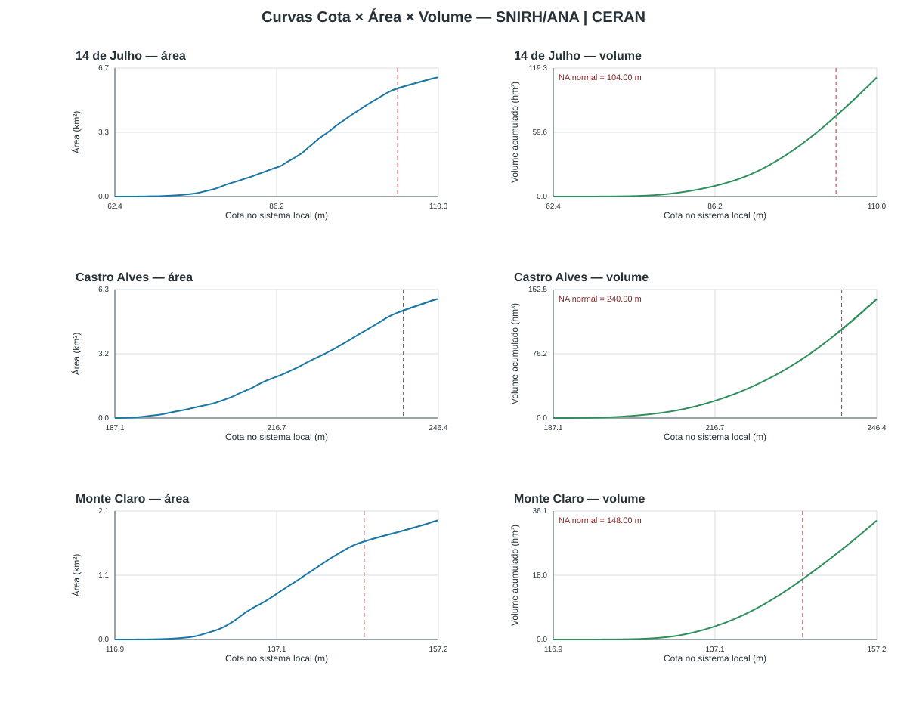

# Dados e métodos

## Dados principais

| Dado | Uso | Situação |
|---|---|---|
| MDE do projeto / ANADEM | relevo, drenagem e triagem de áreas | disponível; cobertura deve ser conferida no trecho detalhado |
| Direções de fluxo D8 | delimitação de áreas contribuintes | disponível |
| BHO/ANA | rede hidrográfica e áreas ottocodificadas | disponível |
| CAVs do SNIRH | reservatórios existentes e deplecionamento | metadados importados; validar datum, versão e série |
| CAVs de eixos novos | área e volume em cotas de estudo | estimadas a partir do MDE; classe B até validação topográfica |
| Atlas Digital de Desastres | perdas e afetados por município | extração preliminar para o recorte de maio de 2024 |
| EUROCLIMA-rev.kmz | inventário de eixos candidatos | convertido e incorporado ao inventário E01–E12 |
| Topobatimetria, pontes e níveis | HEC-RAS 1D | pendente de aquisição/levantamento |

## CAVs e ausência de batimetria

Para reservatórios existentes, o MDE registra a superfície da água e não informa de maneira
confiável o volume abaixo do nível normal. Por isso, o estudo usa as curvas cota–área–volume
do SNIRH quando disponíveis e mantém a batimetria como lacuna explícita.

Para eixos novos, nos quais atualmente não há reservatório, foi adotada uma aproximação por
curvas de nível e área alagada conectada ao eixo. O volume é integrado entre cotas e depois
interpolado com PCHIP para evitar oscilações artificiais. Polinômios são mantidos apenas como
apoio de inspeção, não como representação operacional principal.

O procedimento é compatível com a lógica de reconstrução de relações nível–área–volume a
partir de topografia e áreas inundadas descrita na literatura de sensoriamento remoto e
modelagem de reservatórios; a referência específica está no [capítulo de referências](referencias.qmd).

{#fig-cavs width=95%}

## Hidrologia

O pipeline delimita bacias por busca de montante sobre a grade D8, com ajuste ao controle da
BHO. A vazão específica calibrada para a triagem é **0,0269 m³/s/km²**; os resultados da
primeira rodada com 0,020 m³/s/km² permanecem apenas como histórico.

Os hidrogramas preliminares não substituem uma série consistida. A próxima etapa deverá
recalibrar perdas, transformação chuva–vazão, defasagens entre sub-bacias e volumes de
entrada dos tributários com dados da ANA, ONS e operadores.

## HAND como triagem altimétrica

O HAND (*Height Above Nearest Drainage*) é empregado antes da modelagem hidráulica para
identificar células potencialmente conectadas à drenagem e organizar os níveis de análise.
Ele ajuda a localizar áreas baixas e a priorizar cortes transversais, mas não resolve:

- remanso e controle de jusante;
- perdas de carga em pontes;
- armazenamento dinâmico na planície;
- operação de comportas;
- propagação temporal de ondas em estruturas em série.

Assim, HAND é filtro e ferramenta de comunicação, não substituto do HEC-RAS 1D.

## Rastreabilidade

Os scripts numerados em `07_python/` registram a sequência de preparação. As bases de saída
mais importantes estão em `06_resultados/`, e os achados da trilha de revisão ficam em
`06_resultados/CLAUDE/CLAUDE_ACHADOS_PARA_CODEX.md`.
