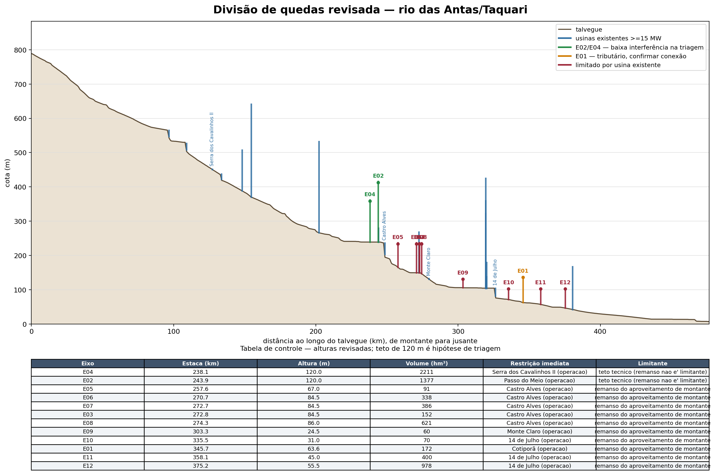
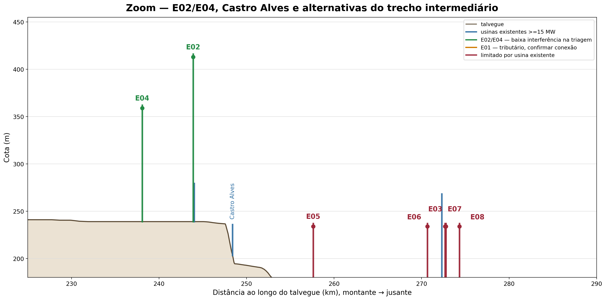
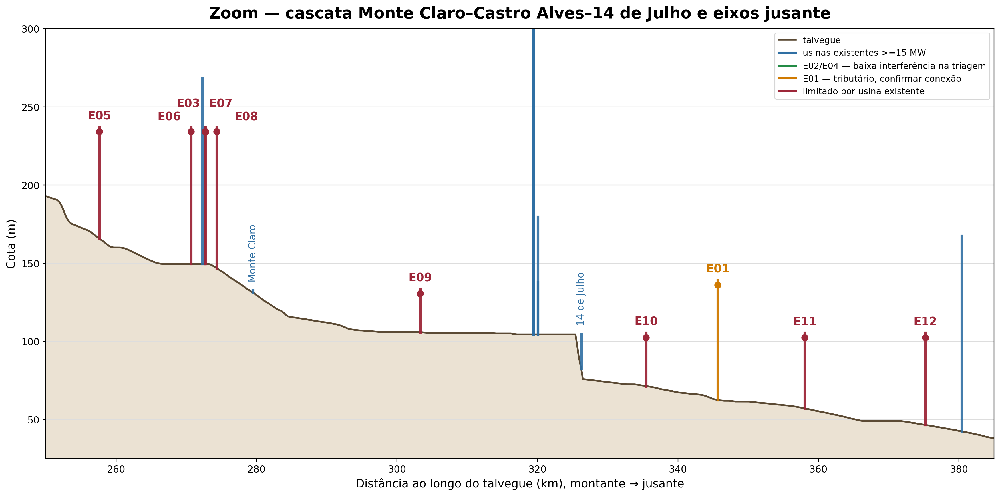
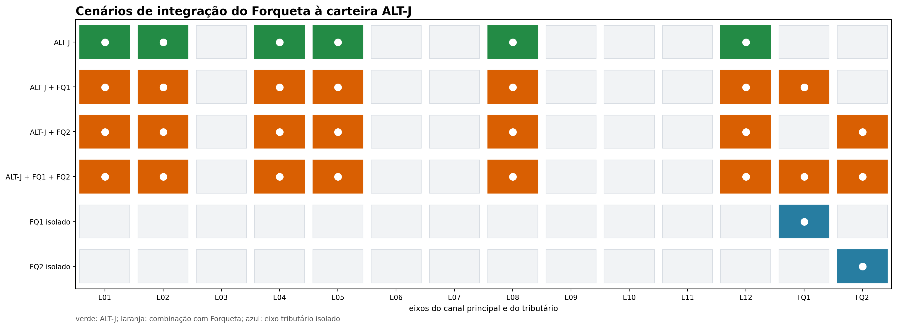
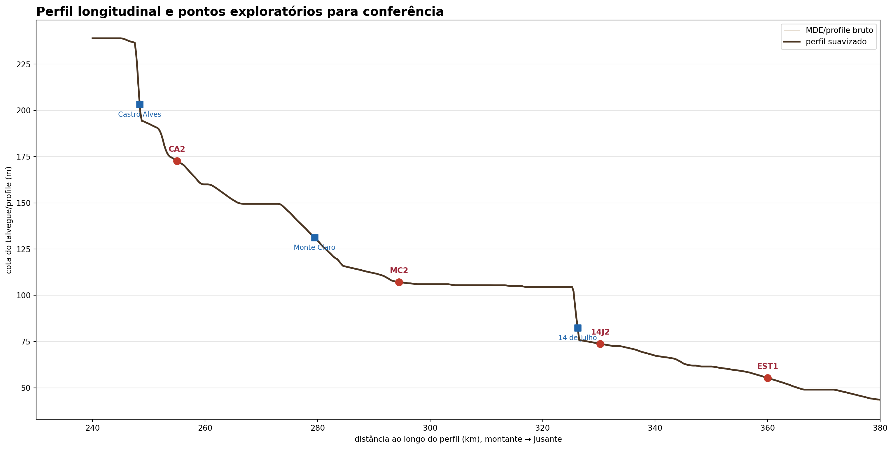
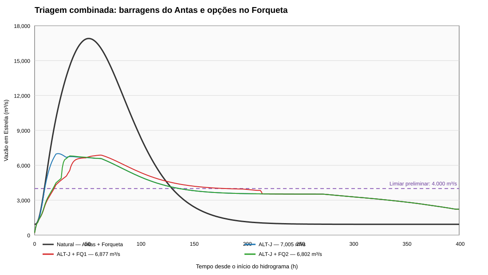
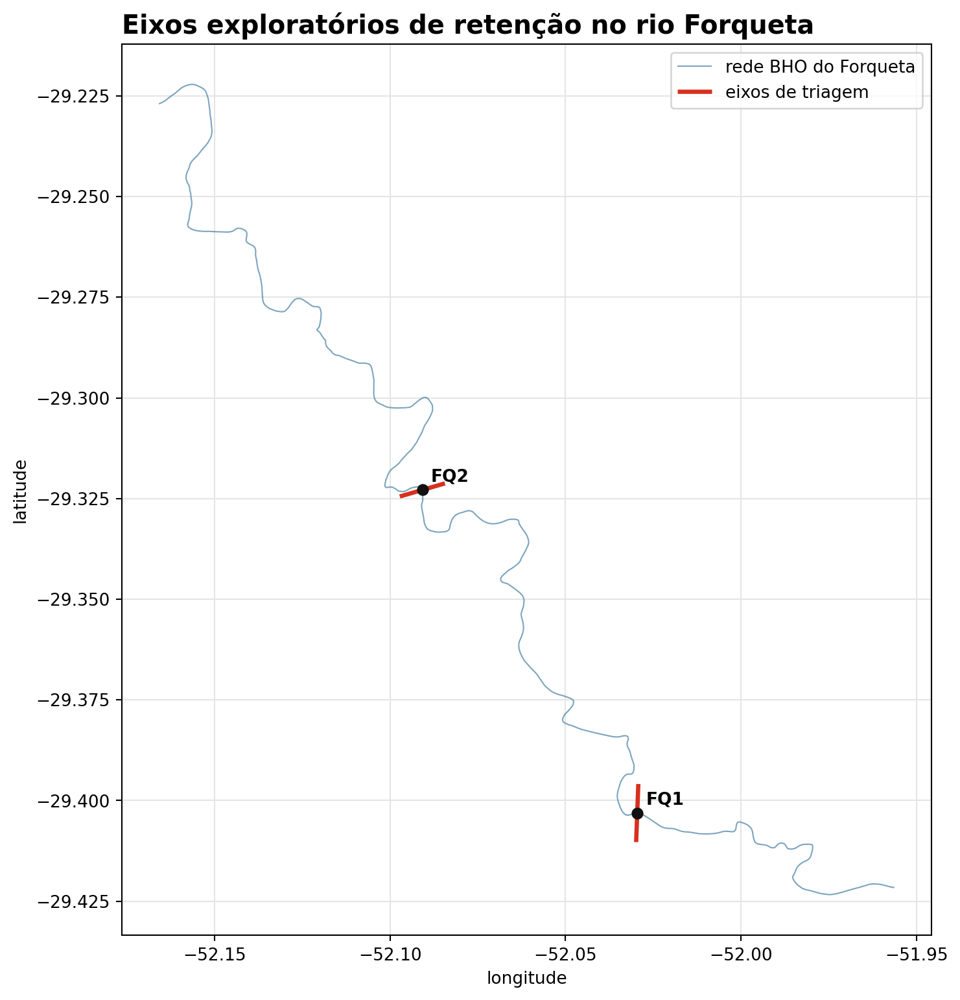
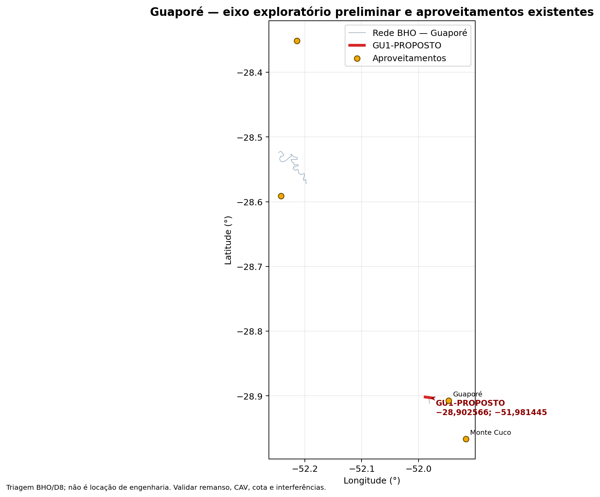

# Alternativas estudadas e justificativa

Esta seção é central para a nota técnica: ela registra as hipóteses avaliadas e o motivo de
manter, descartar ou aprofundar cada uma. A análise não parte de uma barragem escolhida; ela
organiza um portfólio de alternativas para a próxima rodada.

## 1. Referência e arranjos híbridos

O cenário sem novos reservatórios é a referência contra a qual se mede qualquer benefício.
Também devem ser comparados arranjos híbridos com previsão e alerta, ordenamento territorial,
proteção localizada, retenção distribuída, evacuação e operação coordenada dos reservatórios
existentes. Sem essa referência, a barragem pode receber crédito por reduções que seriam
obtidas por medidas de menor prazo.

## 2. Alteamento das UHEs existentes

O alteamento fica documentado como **alternativa de sensibilidade**. As curvas disponíveis
indicam ganho aproximado de **105 hm³ para 10 m** e **139 hm³ para 15 m** de deplecionamento
conjunto das UHEs 14 de Julho, Castro Alves e Monte Claro, diante de uma ordem de grandeza
de **3.230 hm³** usada para a referência.

Esse resultado não encerra a questão: ele indica que os indícios são de valores expressivos
de obra e que o ganho de espera pode ser pequeno. Custos, vertedouro, estabilidade,
remanso, desapropriações, segurança, licenciamento e perda de energia precisam ser
avaliados em nível de projeto. Enquanto isso, o esforço principal deve se concentrar em
eixos novos sem interferência direta nas barragens existentes.

## 3. Primeira rodada de eixos

Os primeiros arranjos BAR-A, BAR-A2 e BAR-B foram úteis para testar a escala, mas são
aninhados. A comparação correta é entre uma estrutura única de grande porte e dois
reservatórios distribuídos que cubram ramos convergentes.

| Arranjo | Lógica | Resultado de triagem |
|---|---|---|
| BAR-A | estrutura única, maior controle | maior volume, maior porte e maior concentração de impactos |
| BAR-A2 + BAR-B | duas estruturas distribuídas | evita uma única obra extrema; exige coordenação e soma de impactos |
| Alternativa híbrida | barragem + medidas não estruturais | permite reduzir o volume estrutural necessário |

## 4. Portfólio E01–E12

O inventário ampliado veio do arquivo `EUROCLIMA-rev.kmz`. Os eixos foram convertidos para
uma base comum e avaliados por volume, área, energia, cobertura e interferência longitudinal.
As alternativas de maior interesse na rodada revisada são:

| Alternativa | Eixos | Área controlada | Volume de espera | Leitura |
|---|---|---:|---:|---|
| ALT-A | E02 + E04 | 11.089 km² | 1.794 hm³ | referência distribuída, apenas prioritários |
| ALT-D | E02 + E04 + E08 | 11.950 km² | 2.104 hm³ | cobertura intermediária, E08 condicionado |
| ALT-E | E02 + E04 + E12 | 15.760 km² | 2.282 hm³ | maior cobertura; E12 condicionado à 14 de Julho |
| ALT-I | E02 + E04 + E01 + E05 + E08 | 14.499 km² | 2.235 hm³ | arranjo intermediário, mais estruturas |
| ALT-H | E12 isolado | 15.760 km² | 488 hm³ | alto alcance, baixa espera e restrição crítica |

Os valores são de triagem e dependem da regra de operação e da definição de volume útil. A
discrepância entre a cota de Monte Claro no MDE principal e a CAV oficial está documentada em
[Conciliação preliminar do datum de Monte Claro](06_resultados/VALIDACAO/CONCILIACAO_DATUM_MONTE_CLARO.md)
e deve ser resolvida antes de fechar a altura admissível de E09.

### Volume nominal e volume efetivamente utilizado

O volume da tabela anterior é a capacidade nominal de espera derivada das CAVs. Na rodada C1–C4,
o roteamento com barragem seca mostrou quanto desse volume foi efetivamente utilizado e qual
foi o pico residual:

| Alternativa | Eixos | Volume nominal (hm³) | Volume usado (hm³) | Pico residual (m³/s) | Redução |
|---|---|---:|---:|---:|---:|
| ALT-A | E02 + E04 | 1.794 | 1.694 | 9.272 | 43,1% |
| ALT-D | E02 + E04 + E08 | 2.104 | 1.871 | 8.411 | 48,4% |
| ALT-E | E02 + E04 + E12 | 2.282 | 2.366 | 6.328 | 61,2% |
| ALT-J | E02 + E04 + E01 + E05 + E08 + E12 | 2.723 | 2.639 | 6.213 | 61,9% |

ALT-J é uma ampliação da carteira que passou a ser analisada na rodada calibrada. O fato de o
volume usado poder superar o volume nominal de 50% da rodada SINV decorre da regra de operação,
do volume inicial, dos aportes incrementais e da definição operacional usada no roteamento; a
comparação final deve ser feita sempre com as séries de nível e volume de cada reservatório.
O arquivo completo é [claude_alternativas_finais.csv](06_resultados/CLAUDE/claude_alternativas_finais.csv).

## Divisão de quedas e restrições longitudinais

A figura geral mostra a posição relativa dos eixos e das usinas existentes. Os dois zooms
separam a região dos eixos prioritários e a cascata das Antas, onde pequenas diferenças de
cota mudam a admissibilidade do reservatório.

{#fig-divisao-quedas width=100%}

{#fig-zoom-castro width=100%}

{#fig-zoom-antas width=100%}

{#fig-divisao-alternativas width=100%}

{#fig-matriz-alternativas width=100%}

{#fig-matriz-forqueta width=100%}

A matriz torna explícita a composição de cada alternativa. As alternativas ALT-A–ALT-I são a
carteira de comparação; C01–C05 são cenários de operação coordenada com comportas. A presença
de um eixo na matriz não significa que a obra tenha sido selecionada: E08, E09–E12 e os eixos
em cascata permanecem condicionados à verificação de remanso, energia, segurança e HEC-RAS 1D.

## Novos pontos exploratórios derivados do perfil

O perfil longitudinal foi suavizado em uma janela móvel e analisado por queda média em
10 km. O objetivo não foi localizar uma barragem pronta, mas indicar trechos que merecem
levantamento topográfico, estudo de conexão hidráulica e verificação de energia.

| Código | Coordenadas WGS84 | Distância no perfil | Queda média em 10 km | Papel preliminar |
|---|---|---:|---:|---|
| CA2-PROPOSTO | −29,0457167; −51,3622784 | 255,00 km | 32,8 m | queda concentrada a jusante de Castro Alves |
| MC2-PROPOSTO | −29,0455307; −51,5562985 | 294,48 km | 6,3 m | geometria fornecida pelo usuário, entre Monte Claro e 14 de Julho |
| 14J2-PROPOSTO | −29,0658852; −51,6384943 | 330,25 km | 33,0 m | queda a jusante de 14 de Julho e controle de cheias |
| EST1-PROPOSTO | −29,1656775; −51,7456402 | 360,00 km | 8,9 m | controle de cheias próximo ao trecho de interesse, baixa energia |

{#fig-perfil-exploratorios width=100%}

### Novos eixos exploratórios no Forqueta — opção condicionada

Como o Forqueta representa aproximadamente **14,63% da área contribuinte da seção de
Estrela**, foram incluídos dois eixos de triagem no seu curso principal. A geometria foi
construída perpendicularmente ao talvegue BHO e reprocessada no pipeline de CAV em uma
rodada isolada.

Há uma distinção espacial essencial: o ponto de análise hidrológica de **19.440 km² está
a montante da confluência do Forqueta**. Assim, FQ1 e FQ2 não alteram o hidrograma nesse
ponto; sua eventual utilidade só aparece nos controles de Lajeado, Estrela e jusante,
quando o hidrograma lateral é inserido no HEC-RAS 1D.

| Código | Coordenadas WGS84 | Área BHO a montante | Cota do eixo no MDE | Volume a 80 m | Papel |
|---|---|---:|---:|---:|---|
| FQ1-PROPOSTO | −29,402960; −52,029700 | 2.353,6 km² | 22,5 m | 2.424 hm³ | opção condicionada à defasagem |
| FQ2-PROPOSTO | −29,322620; −52,090830 | 2.226,7 km² | 40,0 m | 1.289 hm³ | sensibilidade, alternativa exclusiva |

Os volumes foram extraídos da CAV derivada do MDE natural: FQ1 chega a 5.518 hm³ e FQ2
a 3.043 hm³ no teto geométrico de 120 m. Esses valores não são volume operacional nem
altura admissível. A série medida do posto 86745000 reduziu a defasagem central adotada
para 0 dia em 13 eventos e o pico de projeto transposto do Forqueta para 3.837 m³/s.
Entretanto, há uma lacuna no posto durante novembro de 2023, justamente no maior evento
observado em Estrela. A conclusão sobre FQ1 permanece condicionada à reconstituição
subdiária em Barra do Fão.

Na rodada calibrada com exutório em Estrela, ALT-J sem Forqueta reduziu o pico em 58,6%.
ALT-J+FQ1 reduziu 59,3% e ALT-J+FQ2, 59,7%. FQ1 e FQ2 não são combináveis: com 30 m,
o NA preliminar de FQ1 fica 12,5 m acima da cota do eixo FQ2. A eficiência marginal foi
0,33 pp/100 hm³ para FQ1 e 0,74 pp/100 hm³ para FQ2, muito inferior à carteira do Antas.
  Por isso, nenhum dos dois entra na alternativa de referência.

  Isso não significa descartar o Forqueta. Como o tributário conflui a montante de
  Estrela, ele permanece relevante para os controles de Lajeado, Estrela e Bom Retiro do
  Sul e deve ser mantido como alternativa condicionada no HEC-RAS 1D. O que foi retirado
  da referência é a combinação automática com a carteira do Antas, não a hipótese de
  aproveitamento do Forqueta.

#### Triagem combinada Antas + Forqueta

Para verificar se o Forqueta poderia mudar a conclusão, foi executada uma matriz com as
alternativas ALT-A a ALT-J, cenário sem Forqueta, FQ1 e FQ2, e três regras operativas. O
exutório é Estrela e a defasagem adotada é a medida nos eventos pareados: 0 h. O pico
natural sintético resultante é 16.903 m³/s, próximo do máximo observado de 17.261 m³/s em
19/11/2023.

| Regra | Melhor combinação | Pico em Estrela | Redução | Acima de 4.000 m³/s |
|---|---|---:|---:|---:|
| Barragem seca | ALT-J + FQ2 | 6.802 m³/s | 59,8% | 2.802 m³/s |
| Comportas | ALT-J + FQ1 | 7.887 m³/s | 53,3% | 3.887 m³/s |
| Convencional | ALT-D sem Forqueta | 15.799 m³/s | 6,5% | 11.799 m³/s |

O melhor resultado fisicamente admissível foi, portanto, **ALT-J + FQ2**, mas ainda ficou
60,6% abaixo do pico observado de 2023 e acima do limiar preliminar de 4.000 m³/s. Não
houve combinação que levasse a vazão em Estrela a uma magnitude compatível com a não
ocorrência de cheia. O limiar de 4.000 m³/s é apenas uma referência de triagem e deve ser
substituído pela relação cota–dano calibrada no HEC-RAS 1D.

{#fig-hidrogramas-combinados-forqueta width=100%}

- [Matriz completa do roteamento Antas + Forqueta](06_resultados/tabelas/roteamento_combinado_antas_forqueta.csv)
- [Síntese interpretativa da rodada](06_resultados/ROTEAMENTO_COMBINADO_ANTAS_FORQUETA.md)
- [Séries dos hidrogramas combinados](06_resultados/tabelas/hidrogramas_combinados_antas_forqueta.csv)

#### Busca ampliada: adicionar outras barragens à ALT-J

Para verificar se o resultado poderia ser melhorado simplesmente acrescentando outras
barragens da carteira do rio das Antas, foi feita uma busca exaustiva de todas as
**32 adições possíveis à ALT-J**, mantendo E10 fora da carteira principal. Também foi
calculado um envelope teórico com E10, apesar de seu balanço energético preliminar
negativo, e foram testadas **192 combinações** com FQ1, FQ2 ou sem Forqueta, sob regras
de barragem seca e comportas.

| Busca | Melhor composição | Pico em Estrela | Excesso sobre 4.000 m³/s | Combinações abaixo de 4.000 |
|---|---|---:|---:|---:|
| Adições à ALT-J, E10 excluído | ALT-J | 7.005 m³/s | 3.005 m³/s | 0 de 32 |
| Envelope incluindo E10 | ALT-J | 7.005 m³/s | 3.005 m³/s | 0 de 64 |
| Adições à ALT-J + Forqueta | ALT-J + FQ2, seca | 6.802 m³/s | 2.802 m³/s | 0 de 192 |

O fato de as adições E03, E06, E07, E09 e E11 não alterarem o pico terminal não
significa que sejam inúteis em qualquer projeto. O resultado indica que, na
parametrização atual, elas são eixos aninhados ou redundantes em relação ao E12:
quando o E12 está presente, a carteira já controla a mesma área terminal de 81,1%
da seção de análise. Essas barragens ainda podem alterar níveis locais, remanso,
tempo de propagação, distribuição do armazenamento e segurança operacional — efeitos
que somente o HEC-RAS 1D acoplado à operação poderá revelar.

O resultado também delimita a investigação: **não há, entre os eixos adicionais da
carteira atual, uma composição que leve Estrela à faixa preliminar de não inundação**.
O arquivo de [síntese da busca ampliada](06_resultados/BUSCA_CARTEIRAS_AMPLIADAS_ANTAS_FORQUETA.md)
e as [32 carteiras principais](06_resultados/tabelas/carteiras_ampliadas_antas_principal.csv),
o [envelope com E10](06_resultados/tabelas/carteiras_ampliadas_antas_envelope_E10.csv) e
as [combinações com Forqueta](06_resultados/tabelas/carteiras_ampliadas_antas_forqueta.csv)
ficam como trilha reproduzível.

{#fig-eixos-forqueta width=100%}

- [Tabela dos eixos e áreas do Forqueta](06_resultados/tabelas/eixos_forqueta_propostos.csv)
- [KMZ dos eixos de triagem no Forqueta](06_resultados/GIS/eixos_forqueta_propostos.kmz)
- [CAV isolada dos eixos do Forqueta](01_dados/cav_forqueta/cav_todos.csv)

Os pontos são deliberadamente chamados de **propostos**. O arquivo separado
`EIXO-MONTECLARO2.kmz` foi conferido e contém uma `LineString` sobre o canal principal. O
ponto médio dessa linha está na estaca aproximada 294,48 km do perfil e a cerca de 12 m do
talvegue amostrado; a geometria original foi preservada no KMZ consolidado. A cota usada na
triagem vem do perfil suavizado do MDE, não das altitudes gravadas no KML, que ainda precisam
ser conferidas quanto ao datum. Os demais elementos do `EUROCLIMA-rev.kmz` continuam com
rótulos genéricos `EIXO` e não devem ser tratados como alternativas selecionadas sem validação.

- [Tabela de coordenadas e critérios](06_resultados/tabelas/eixos_exploratorios_propostos.csv)
- [KMZ para conferência](06_resultados/GIS/eixos_exploratorios_propostos.kmz)
- [KML aberto](06_resultados/GIS/eixos_exploratorios_propostos.kml)
- [GeoPackage dos pontos](06_resultados/GIS/eixos_exploratorios_propostos.gpkg)

### Como esses pontos entram nas alternativas

CA2, MC2 e 14J2 devem entrar primeiro como cenários isolados de sensibilidade. FQ1 e FQ2
devem permanecer fora da alternativa de referência; FQ1 só deve ser reaberto se a série
subdiária de Barra do Fão confirmar defasagem positiva no evento de projeto. FQ1 e FQ2
devem ser tratados como alternativas mutuamente exclusivas, nunca como uma cascata conjunta.
EST1 deve ser mantido como alternativa de controle de cheias, não como eixo energético:
sua queda média é pequena e o benefício depende principalmente de armazenamento e operação.

O achado novo que merece prioridade é o **rio Guaporé**. O posto Santa Lúcia (86580000)
indica cerca de 2.470 km², contribuição comparável à do Forqueta, mas situada a montante
do ponto de análise e sem eixo de controle na carteira E01–E12. A hipótese de um eixo no
Guaporé deve ser investigada separadamente, com BHO/D8, CAV preliminar, interferência com
Monte Cuco/Guaporé e roteamento; ainda não é uma alternativa selecionada.

O Guaporé é, portanto, a próxima adição estrutural a ser investigada. Diferentemente de
uma simples adição de E03/E06/E07/E09/E11, ele exige separar do hidrograma sintético do
Antas a parcela de sua sub-bacia, roteá-la pelo GU1 e recompor a contribuição na seção de
19.440 km². Sem essa separação, somar um hidrograma do Guaporé produziria dupla contagem.

#### Primeira triagem numérica do GU1

Com a série do posto Santa Lúcia (86580000), foi feita uma decomposição explícita do
hidrograma: 2.486,7 km² do Guaporé e 16.953,3 km² de vertente residual do Antas. O GU1
controla preliminarmente 1.993,7 km² (80,2% do Guaporé). Foram testadas duas magnitudes
de afluência do Guaporé — o máximo histórico observado e o máximo de novembro de 2023 —,
defasagens de 0 a 24 h, alturas de 30 a 120 m e combinações com ALT-J e FQ2.

| Evento / hipótese | Composição | Altura GU1 | Defasagem | Pico em Estrela | Excesso sobre 4.000 |
|---|---|---:|---:|---:|---:|
| Máximo histórico Santa Lúcia | ALT-J + GU1 | 100 m | 0 h | 4.532 m³/s | 532 m³/s |
| Novembro de 2023 | ALT-J + GU1 | 120 m *(envelope)* | 0 h | 4.763 m³/s | 763 m³/s |
| Máximo histórico + FQ2 | ALT-J + GU1 + FQ2 | 100 m | 0 h | 6.166 m³/s | 2.166 m³/s |

O melhor resultado da matriz foi **4.532 m³/s**, no cenário do máximo histórico do
Guaporé, com ALT-J e GU1 a 100 m. Nenhuma das 384 combinações testadas ficou abaixo
de 4.000 m³/s. O FQ2 não melhorou esse arranjo porque sua contribuição lateral e sua
regra de descarga alteram a onda em outro ponto do sistema; a combinação deve ser
reavaliada no HEC-RAS 1D, não descartada apenas pelo pico agregado desta triagem.

Os números usam hidrogramas Gamma sintéticos, pico diário transposto, CAV derivada de
MDE e 120 m apenas como envelope geométrico. Não são altura admissível nem projeto de
operação. O [roteamento GU1 + Antas](06_resultados/ROTEAMENTO_GUAPORE_ANTAS.md), a
[tabela completa](06_resultados/tabelas/roteamento_guapore_antas.csv) e o
[hidrograma comparativo](06_resultados/VALIDACAO/HIDROGRAMAS_GUAPORE_ALTJ.svg) deixam
essa etapa reproduzível.

{#fig-eixo-guapore-triagem width=100%}

- [KMZ do eixo GU1 para conferência](06_resultados/GIS/eixo_guapore_proposto.kmz)
- [Shapefile do eixo GU1](06_resultados/GIS/SHP/eixo_guapore_proposto.shp)
- [CAV isolada do GU1](01_dados/cav_guapore/cav_todos.csv)

Nenhum ponto deve ser convertido automaticamente em E13. A numeração oficial só deve ser
atualizada depois que a geometria do KMZ for confirmada e o pipeline de bacias, CAV,
topologia e restrições for reexecutado.

## 5. Alternativas que irão ao HEC-RAS 1D

As alternativas que aparentam melhor cobertura não são automaticamente as melhores: E12
interage com a 14 de Julho, E08 com Castro Alves e E09–E11 com a cascata das Antas. O
critério de “não interferência” também deve distinguir o início de perda energética do
nível de veto físico. Essa separação evita descartar cedo demais eixos que podem ser
operados com perda controlada — ou aceitar eixos cujo remanso seja inviável.

Para não confundir carteira, cenário de comportas e afluência lateral, a entrada no HEC-RAS
1D fica organizada assim:

| Ordem | Plano HEC | Alternativa/cenário | Composição | Finalidade |
|---:|---|---|---|---|
| 0 | **HEC-00 / REF** | situação atual | sem novos reservatórios | calibrar a resposta hidráulica e a curva cota–dano |
| 1 | **HEC-01 / ALT-A / C01** | base | **E02 + E04** | primeiro caso com obra, com dois ramos prioritários |
| 2 | **HEC-02 / ALT-D / C03** | intermediária | **E02 + E04 + E08** | medir o ganho incremental de E08, condicionado a Castro Alves |
| 3 | **HEC-03 / ALT-E / C02** | cobertura | **E02 + E04 + E12** | medir a cobertura terminal, condicionada a 14 de Julho |
| 4 | **HEC-04** | extensão estrutural | **ALT-J + GU1** | testar o Guaporé, que controla uma contribuição independente a montante |
| 5 | **HEC-05** | extensão lateral | **ALT-J + FQ2** | testar o Forqueta no trecho de Estrela, sem somá-lo ao montante de 19.440 km² |
| 6 | **HEC-06** | sensibilidades | C04, C05, FQ1 e combinações selecionadas | testar comportas, saturação, galgamento e hipóteses de maior complexidade |

O caso **HEC-01 (E02 + E04)** é o primeiro arranjo com obra que deve ser construído
depois do caso sem obra. HEC-02 e HEC-03 são comparações incrementais, não escolhas
prévias. O HEC-04 entra depois da calibração porque exige retirar a sub-bacia do Guaporé
do hidrograma residual do Antas; o HEC-05 entra como contribuição lateral observada. FQ1
e FQ2 são mutuamente exclusivas e FQ1 permanece condicionada à resolução da lacuna de
novembro de 2023.

::: {.callout-warning}
## Decisão provisória, agora explicitada

Não há alternativa selecionada para implantação. A **matriz mínima obrigatória** é
**HEC-00 + HEC-01 + HEC-02 + HEC-03**; a **extensão prioritária** é **HEC-04 (ALT-J + GU1)**;
HEC-05 e HEC-06 são sensibilidades. O primeiro caso com obra é E02 + E04. A seleção só
será feita depois de remanso, operação, curva cota–dano, energia, segurança e custos
serem avaliados com a mesma base de comparação.
:::

O diagrama que acompanha essa decisão está em
[topologia e sequência de cenários](06_resultados/VALIDACAO/DIAGRAMA_TOPOLOGICO_ALTERNATIVAS_HECRAS.svg).

## 6. Critérios para a rodada contratada

Cada alternativa deve ser avaliada com o mesmo evento, mesma curva cota–dano e mesma
referência econômica, reportando:

- pico e cota máxima em Estrela e pontos intermediários;
- redução de duração acima de cotas críticas;
- volume de espera inicial e volume efetivamente utilizado;
- municípios, pessoas e ativos protegidos;
- interferência em UHEs existentes e energia firme;
- segurança, galgamento, operação e falhas;
- custo de implantação, operação, manutenção e compensações.
