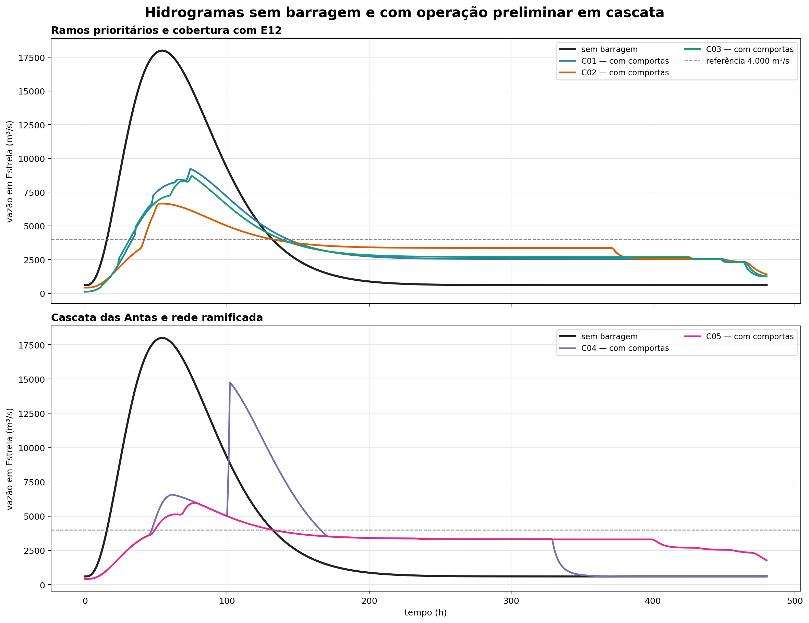
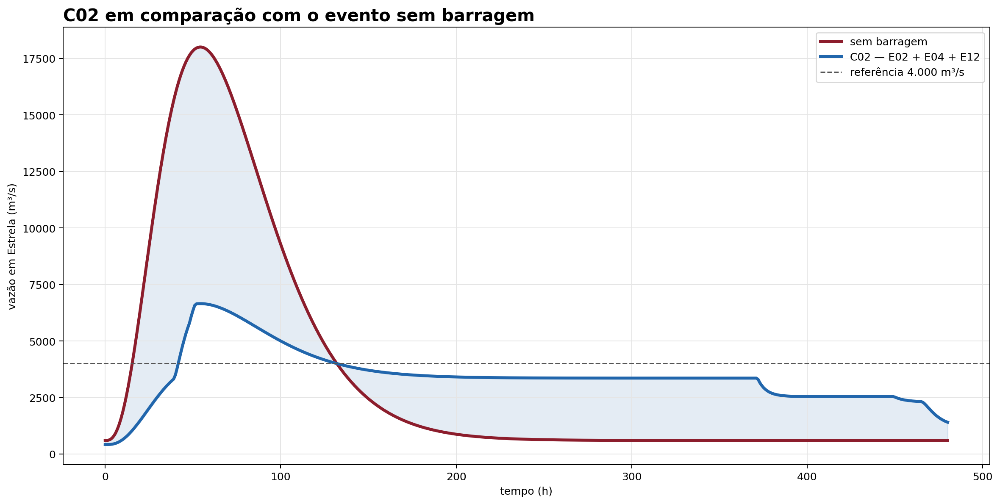
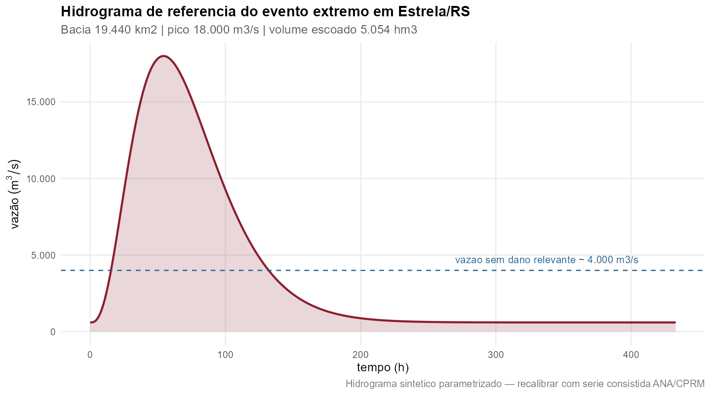
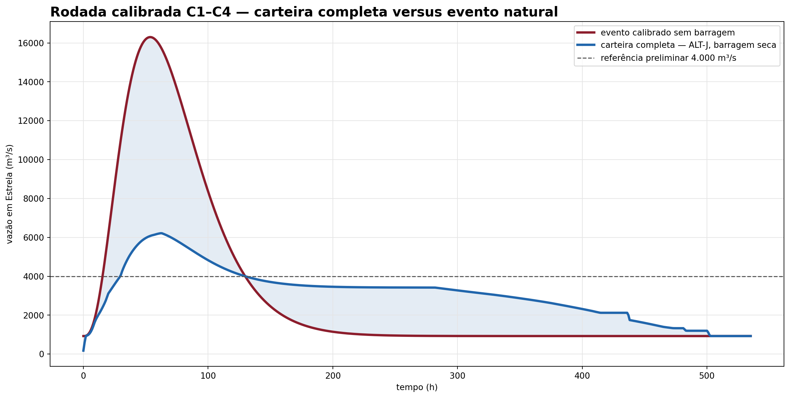

# Hidrologia e HAND

## Delimitação e vazões

O delineamento de montante foi realizado sobre o D8 e conferido contra áreas da BHO/ANA.
Para BAR-A, a área controlada foi aproximadamente 15.760 km², com aderência inferior a 1%
ao controle ottocodificado. A consistência espacial é suficiente para uma triagem, mas não
substitui a calibração hidrológica.

O valor calibrado de referência para a vazão específica é 0,0269 m³/s/km². O número deve
ser substituído por parâmetros derivados de séries observadas e por uma transformação
chuva–vazão calibrada para o evento de 2024 e para eventos de projeto.

## Cadeia de cálculo hidrológico

O cálculo preliminar foi organizado em uma sequência simples e auditável:

1. delimitar a área incremental de cada eixo pela grade D8 e conferir a área contra a BHO;
2. estimar a afluência com a vazão específica, mantendo o fator explícito;
3. construir um hidrograma sintético com forma gamma para representar o evento de referência;
4. separar os hidrogramas dos ramos antes de combiná-los, para preservar a defasagem;
5. aplicar a continuidade em cada reservatório, `S(t+Δt) = S(t) + [I(t) − O(t)]Δt`;
6. limitar o armazenamento pela CAV e registrar saturação, galgamento e volume de espera;
7. transferir o hidrograma resultante ao ponto de Estrela e, na etapa seguinte, ao HEC-RAS 1D.

O volume de espera requerido é calculado, para uma vazão-alvo preliminar, por

`V_req = ∫ max[0, Q_afluente(t) − Q_alvo] dt`.

O valor é convertido para hm³ dividindo o volume em m³ por `10⁶`. A escolha de `Q_alvo`,
a duração do evento e a sincronização entre ramos são parâmetros sensíveis; por isso, o
resultado não pode ser transformado diretamente em volume de uma obra.

## Volume requerido, volume alocado e cota de cada reservatório

É importante separar dois cálculos que têm finalidades diferentes:

1. **Volume requerido em Estrela:** `V_req = ∫ max[0, Q_Estrela(t) − Q_alvo] dt`. Esse é o volume que, em uma hipótese ideal de controle total e sincronização perfeita, precisaria ser retirado do hidrograma na seção de controle de Estrela para não superar a vazão-alvo.
2. **Volume de espera nominal da alternativa:** para cada eixo `i`, a rodada SINV adota uma altura admissível `H_i` e uma fração de espera `f_esp = 50%`. O volume é calculado pela CAV individual: `V_espera,i = f_esp × V_max,i(H_i)`. O volume da alternativa é a soma desses volumes, sem afirmar que ele será utilizado integralmente no mesmo instante.

Portanto, na rodada atual **o volume requerido não é distribuído entre os reservatórios por uma otimização** e não é usado para resolver automaticamente a cota de cada barragem. As cotas são obtidas individualmente invertendo a CAV de cada eixo:

`NA_mxn,i = cota_eixo,i + CAV_i⁻¹[V_max,i(H_i) − V_espera,i]`.

Isso produz o nível de espera/nível máximo normalizado da simulação energética. A cota depende da CAV daquele reservatório, de sua altura admissível e da fração de espera; não existe uma única cota comum para toda a alternativa.

Exemplo da alocação nominal usada nas alternativas principais:

| Eixo | Altura admissível (m) | Volume máximo (hm³) | Volume de espera (hm³) | Cota `NA_mxn` (m) |
|---|---:|---:|---:|---:|
| E02 — ALT-A | 120,0 | 1.377,4 | 688,7 | 385,8 |
| E04 — ALT-A | 120,0 | 2.210,7 | 1.105,3 | 326,9 |
| E08 — ALT-D | 86,0 | 620,4 | 310,2 | 209,8 |
| E12 — ALT-E/C02 | 55,5 | 976,5 | 488,2 | 86,8 |

Assim, ALT-A soma 1.794 hm³ nominais, ALT-D soma 2.104 hm³ e ALT-E/C02 soma 2.282 hm³.
Esses valores não devem ser comparados diretamente com `V_req` como se fossem equivalentes:
o primeiro é uma capacidade inicial distribuída conforme CAVs; o segundo é uma integral do
excesso de vazão em Estrela. O roteamento é que deve mostrar quanto do volume é efetivamente
utilizado, em que momento, em qual reservatório, e qual pico resulta a jusante.

### Onde está a vazão-alvo

Na formulação atual, `Q_alvo = 4.000 m³/s` é uma **vazão-alvo preliminar na seção de controle de
Estrela**, associada à hipótese de vazão abaixo da qual não haveria dano relevante. Ela não é
uma vazão medida na entrada de cada reservatório nem uma vazão definida a montante de Estrela.
O valor de 4.000 m³/s é um placeholder e deve ser recalibrado a partir das cotas de inundação,
curvas-chave, danos observados e do HEC-RAS 1D.

No roteamento simplificado das comportas, essa meta de Estrela foi convertida em metas locais
proporcionais à área contribuinte: `Q_alvo,i = 4.000 × A_i / 19.440`. Essa regra é apenas uma
aproximação de triagem para repartir a meta entre os eixos; ela não representa uma condição
hidráulica local observada. Na modelagem contratada, as descargas de cada reservatório deverão
ser escolhidas pelo hidrograma incremental, tempo de viagem, afluências laterais e nível na
seção de controle em Estrela.

## Hidrogramas com e sem reservatórios

As figuras abaixo mostram a diferença entre o evento sem reservatório e a triagem com
operação coordenada de comportas. C01 é composto por E02 + E04, C03 por E02 + E04 + E08
e C02 por E02 + E04 + E12. No HEC-RAS 1D, eles serão comparados nessa ordem, depois do
HEC-00 sem obra; C02 não é uma alternativa escolhida, mas o terceiro caso da sequência
mínima. Todos dependem de CAVs, remanso e regras operacionais verificadas.

{#fig-hidrogramas-cascatas width=100%}

{#fig-hidrograma-c02 width=100%}

{#fig-hidrograma-referencia width=100%}

Na triagem, os picos resultantes foram 9.217 m³/s para C01, 6.650 m³/s para C02,
8.713 m³/s para C03, 14.753 m³/s para C04 e 5.965 m³/s para C05. C04 saturou os quatro
reservatórios considerados; C05 apresentou um reservatório saturado e um galgamento.
Esses números são de roteamento preliminar, não de simulação hidráulica calibrada.

## Rodada calibrada C1–C4

O Claude executou uma segunda rodada com séries obtidas da ANA, máximas anuais de Muçum e
parâmetros recalibrados. O pico sintético de referência passou de 18.000 para **16.300 m³/s**
no ponto de análise, a lâmina escoada passou de 260 para **227 mm** e a vazão de base passou
de 600 para **926 m³/s**. O posto de Estrela possui somente 3,1 anos de vazão; por isso, a
transposição e a curva-chave ainda exigem confirmação com as medições previstas no TR.

O ajuste de Gumbel por momentos-L em Muçum indica que o pico de setembro de 2023 corresponde
a aproximadamente **333 anos**. Maio de 2024 teve menor pico, mas maior volume escoado; o
relatório passa a tratar as duas cheias como eventos distintos, sem chamar automaticamente
uma delas de “evento de 100 anos”.

Com a regra de barragem seca e os parâmetros calibrados, o roteamento das alternativas produziu:

| Alternativa | Eixos | Volume efetivamente usado (hm³) | Pico em Estrela (m³/s) | Redução |
|---|---|---:|---:|---:|
| ALT-A | E02 + E04 | 1.694 | 9.272 | 43,1% |
| ALT-D | E02 + E04 + E08 | 1.871 | 8.411 | 48,4% |
| ALT-E | E02 + E04 + E12 | 2.366 | 6.328 | 61,2% |
| ALT-J — carteira completa | E02 + E04 + E01 + E05 + E08 + E12 | 2.639 | 6.213 | 61,9% |
| E12 isolado | E12 | 976 | 16.267 | 0,2% |

Nenhuma das 30 combinações testadas chegou a 4.000 m³/s. A comparação mostra por que o E12
não deve ser avaliado apenas pela área controlada: isolado, ele satura antes do pico e reduz
praticamente nada; combinado com E02 e E04, passa a operar depois do amortecimento a montante.
As regras convencionais de soleira livre produziram redução máxima de apenas 2,8%, contra 61,9%
na melhor configuração de barragem seca.

{#fig-hidrograma-calibrado width=100%}

Os valores calibrados substituem a rodada sintética como referência para a próxima análise, mas
continuam sendo uma simulação de triagem: a decomposição ainda é proporcional à área e o
limiar de 4.000 m³/s permanece provisório. A rodada específica do Forqueta foi posteriormente
recalculada com a série observada do posto 86745000.

## Eixos de retenção no Forqueta

Para avaliar a contribuição lateral, foram propostos dois pontos no Forqueta, cuja área
contribuinte representa cerca de 14,63% da bacia da seção de Estrela. O FQ1, no segmento
inferior, controla aproximadamente 2.354 km² (82,7% do tributário); o FQ2, em posição
intermediária, controla aproximadamente 2.227 km² (78,3%).

O Forqueta, contudo, deságua a jusante do ponto de análise de 19.440 km². Portanto, os
eixos FQ1/FQ2 são invisíveis no hidrograma desse ponto e só podem ser avaliados nos controles
de Lajeado/Estrela, com uma afluência lateral inserida no modelo hidráulico.

O pipeline isolado confirmou aderência espacial entre D8 e BHO de 0,9985 para FQ1 e 0,9899
para FQ2. A CAV preliminar indica, a 80 m de altura geométrica, cerca de 2.424 hm³ em FQ1
e 1.289 hm³ em FQ2. O resultado é uma indicação de escala, não uma altura admissível: faltam
topografia de maior resolução, geologia, ocupação, remanso, segurança, licenciamento e regra
operativa.

O roteamento calibrado usou a série observada do Passo do Coimbra (86745000), com pico
transposto de 3.837 m³/s. Em 13 eventos pareados, a defasagem central até Estrela foi 0 dia.
Com esse parâmetro, ALT-J reduziu o pico em Estrela em 58,6%, ALT-J+FQ1 em 59,3% e
ALT-J+FQ2 em 59,7%. O ganho marginal é pequeno e FQ1/FQ2 são mutuamente exclusivos por
interferência de cota: o NA preliminar de FQ1 a 30 m fica 12,5 m acima do eixo FQ2.

A evidência ainda não fecha o caso: o Passo do Coimbra tem lacuna em novembro de 2023,
quando Estrela registrou 17.261 m³/s e Muçum já estava em queda. O próximo dado crítico é
uma série subdiária ou curva-chave reativada em Barra do Fão. Até lá, FQ1 e FQ2 permanecem
opções condicionadas, fora da alternativa de referência.

Essa é uma exclusão da referência, não um descarte do tributário: por confluir antes de
Estrela, o Forqueta continua sendo uma afluência lateral potencialmente relevante no
HEC-RAS 1D para Lajeado, Estrela e Bom Retiro do Sul.

Na matriz ampliada com ALT-A–ALT-J, a melhor combinação preliminar foi **ALT-J + FQ2**
com barragem seca: pico de aproximadamente **6.802 m³/s** em Estrela, redução de 59,8%
e ainda 2.802 m³/s acima do limiar provisório de 4.000 m³/s. Com comportas, o melhor
arranjo foi ALT-J + FQ1, com 7.887 m³/s. Assim, o Forqueta deve seguir na modelagem como
alternativa lateral, mas os resultados atuais não indicam uma condição próxima da
não ocorrência de cheia. A matriz completa está no [resultado combinado](06_resultados/ROTEAMENTO_COMBINADO_ANTAS_FORQUETA.md).

## Busca ampliada de barragens

Foi realizada uma busca exaustiva das adições possíveis à ALT-J. As 32 carteiras com
E10 excluído, o envelope teórico de 64 carteiras incluindo E10 e as 192 combinações
com FQ1/FQ2 não produziram nenhum pico inferior a 4.000 m³/s. O melhor resultado
continua sendo ALT-J + FQ2, sob regra de barragem seca, com aproximadamente
**6.802 m³/s** em Estrela.

Essa repetição do pico para as adições E03, E06, E07, E09 e E11 decorre da topologia
aninhada da rodada: com E12 presente, os eixos adicionais não ampliam a área terminal
controlada no modelo simplificado. Isso não elimina seu interesse hidráulico local,
mas impede apresentá-los como uma solução adicional de redução no exutório sem
reformular a operação, os tempos de viagem e o modelo 1D. O E10 foi mantido apenas
como envelope teórico, pois seu balanço energético preliminar é negativo.

O Guaporé deve ser tratado como a próxima hipótese estrutural. Como ele não possui um
eixo dedicado na carteira E01–E12, sua contribuição precisa ser desagregada do
hidrograma do Antas antes de ser roteada pelo GU1; somá-la diretamente ao hidrograma
atual seria dupla contagem. Os resultados e tabelas da busca estão na
[síntese das carteiras ampliadas](06_resultados/BUSCA_CARTEIRAS_AMPLIADAS_ANTAS_FORQUETA.md).

Na primeira decomposição numérica, o GU1 controlou 1.993,7 km² dos 2.486,7 km² do
Guaporé. Com ALT-J e o máximo histórico do Santa Lúcia, a altura de 100 m reduziu o
pico estimado em Estrela para **4.532 m³/s**; o envelope de 120 m não trouxe redução
adicional relevante. No cenário de novembro de 2023, com vazão observada menor no
Guaporé, o resultado a 120 m e defasagem zero foi **4.763 m³/s**. Em 384 combinações
de evento, defasagem, altura, operação, ALT-J e FQ2, nenhuma ficou abaixo de 4.000 m³/s.
Essa rodada confirma que GU1 merece prioridade, mas ainda não substitui a modelagem
hidráulica nem autoriza a altura testada.

{#fig-hidrogramas-combinados-hand width=100%}

{#fig-forqueta-hidrologia width=100%}

## Uso do HAND

O HAND organiza a diferença de cota entre o terreno e a drenagem mais próxima. No estudo,
ele cumpre três funções:

1. indicar setores potencialmente conectados ao rio;
2. orientar a seleção de seções e pontos de controle;
3. comunicar a triagem altimétrica de forma intuitiva.

O método não calcula a onda de cheia por si só. A cota HAND não deve ser convertida
diretamente em profundidade de inundação quando há pontes, diques, remanso ou armazenamento
fora do talvegue.

## O que foi calculado e o que não foi

Foi calculada uma triagem espacial de áreas baixas, bacias contribuintes, volume de espera
e resposta temporal de reservatórios idealizados. Ainda não foi calculada uma mancha de
inundação final com níveis observados, perdas de carga em pontes, remanso de jusante e
seções topobatimétricas. Essa distinção é essencial: HAND filtra e explica; o HEC-RAS 1D
transforma vazão em cota, profundidade e duração.

## Preparação para o HEC-RAS 1D

Depois da triagem, o eixo principal deve ser modelado em HEC-RAS 1D com seções transversais,
pontes, confluências, rugosidades, condições de contorno e estruturas de controle. A
preparação preliminar já está descrita no [capítulo de HEC-RAS 1D](06-hecras-1d.qmd). A
ordem operacional está fixada em **HEC-00 sem obra → HEC-01 (E02 + E04) → HEC-02
(E02 + E04 + E08) → HEC-03 (E02 + E04 + E12)**. Somente depois entram HEC-04
(ALT-J + GU1), HEC-05 (ALT-J + FQ2) e as sensibilidades de rede. O diagrama
[topológico](06_resultados/VALIDACAO/DIAGRAMA_TOPOLOGICO_ALTERNATIVAS_HECRAS.svg)
mostra quais entradas são estruturas do rio principal e quais são afluências laterais.

## Limitações da rodada hidrológica

- hidrogramas sintéticos ainda não substituem a modelagem hidráulica calibrada;
- a defasagem central medida do Forqueta é 0 dia, mas não cobre o evento de novembro de 2023;
- Forqueta representa aproximadamente 14,63% da bacia de Estrela e deve entrar como
  contribuição lateral concentrada, não como vazão no ponto de 19.440 km²;
- FQ1 e FQ2 são alternativas mutuamente exclusivas e não integram a referência;
- o Guaporé, a montante do ponto de análise, ainda precisa ser investigado;
- o trecho final possui declividade estimada muito baixa, podendo ser controlado por remanso;
- não se deve somar hidrogramas gama independentes como se fossem uma única série sem
  sincronização física.

::: {.callout-note}
## Referência metodológica

O conceito HAND e sua aplicação em estudos de inundação devem ser apresentados com a
referência técnica indicada em [Referências](referencias.qmd), sempre deixando claro que
esta etapa é uma triagem anterior ao modelo hidráulico.
:::
