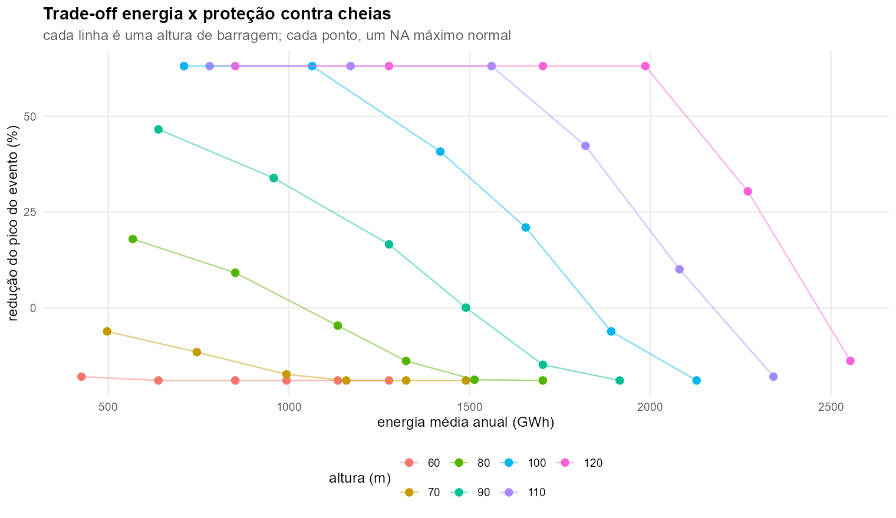
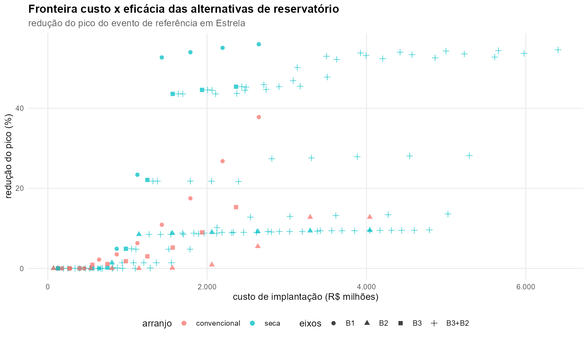
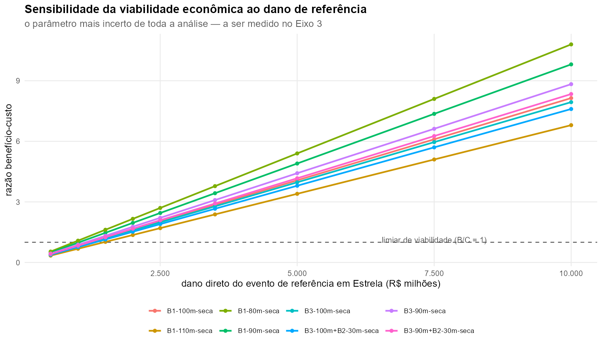

# Danos, exposição e economia

## Atlas Digital de Desastres

O recorte preliminar foi extraído do [Atlas Digital de Desastres do MDR](https://atlasdigital.mdr.gov.br/paginas/graficos.xhtml#)
para os municípios a jusante e no entorno do trecho protegido. A base registra pessoas
afetadas, mortos, feridos, desabrigados, desalojados, danos materiais e prejuízos públicos
e privados.

O arquivo resultante é [atlas_danos_municipios.csv](06_resultados/tabelas/atlas_danos_municipios.csv).
Ele deve ser tratado como uma base de calibração e contexto, não como dano diretamente
atribuível a uma única cota do rio: o Atlas é organizado por evento e município, enquanto
o HEC-RAS produz níveis, velocidades e duração espacialmente distribuídos.

A primeira integração operacional está em
[base_exposicao_municipal_preliminar.csv](06_resultados/tabelas/base_exposicao_municipal_preliminar.csv),
com a documentação correspondente em
[BASE_EXPOSICAO_MUNICIPAL_PRELIMINAR.md](06_resultados/BASE_EXPOSICAO_MUNICIPAL_PRELIMINAR.md).
Ela combina a área/profundidade média da mancha HAND com os recortes do Atlas para
19 municípios. População, domicílios, setores censitários, tipologias construtivas
e custo de reposição permanecem identificados como campos pendentes; não foram
preenchidos por aproximações sem fonte espacial compatível.

## Curva cota–dano preliminar

Para transformar hidráulica em risco, a estratégia é combinar:

1. áreas inundadas e cotas do HEC-RAS 1D;
2. setores censitários e malhas territoriais do IBGE;
3. estoques físicos, população e usos do solo;
4. valores econômicos por tipo de ativo, com fontes IPEA/IBGE e bases setoriais;
5. registros observados do Atlas para conferir a ordem de grandeza;
6. funções de dano por profundidade, duração e tipo de ocupação.

O resultado deve ser uma curva ou superfície que permita calcular dano esperado por cenário,
município e classe de ativo. A curva não deve distribuir o prejuízo total do Atlas
proporcionalmente à área sem antes considerar exposição e profundidade.

## Cálculo energético

Para cada alternativa, a triagem energética usa a queda líquida disponível e a vazão
turbinável. A potência instantânea é estimada por

`P(t) = η ρ g Q_turb(t) H_liq(t) / 10⁶`,

com `η` como eficiência agregada, `ρ` como massa específica da água, `g` como gravidade,
`Q_turb` em m³/s e `H_liq` em m. A energia é obtida integrando a potência no tempo e
convertendo MWh para GWh. A potência é limitada pela potência instalada e a vazão é
reduzida quando a operação de cheia exige volume de espera.

O balanço de uma alternativa deve ser reportado como

`ΔE_liq = E_novo − E_perdida_nas_usinas_existentes`.

Essa formulação é mais informativa que classificar um eixo como simplesmente “viável” ou
“inviável”: há uma altura em que começa a perda de energia e outra em que a cota entra em
conflito físico ou operacional com a usina existente. O fator de vazão específica usado na
rodada v2 é 0,0269 m³/s/km²; os resultados com 0,020 pertencem apenas ao histórico.

{#fig-tradeoff-energia width=100%}

## Cálculo custo–benefício

O procedimento econômico é composto por quatro etapas:

1. calcular o dano esperado anual sem medida, integrando a função dano–frequência;
2. repetir a integração com o hidrograma, cota, duração e exposição de cada alternativa;
3. atualizar o benefício anual para o horizonte de análise;
4. comparar benefício presente, CAPEX, O&M, energia e perdas de geração.

Para uma taxa de desconto `i` e horizonte `n`, o fator de valor presente é

`FVP = [1 − (1 + i)^−n] / i`.

O benefício presente é `VP_B = benefício_anual × FVP`; o custo presente inclui CAPEX e
O&M; e a decisão econômica deve observar simultaneamente `VPL = VP_B − VP_C` e
`B/C = VP_B / VP_C`. Para alternativas mutuamente exclusivas, o VPL líquido é mais
informativo que ordenar apenas pela razão B/C.

## Atualização com a rodada hidrológica calibrada

A rodada C1–C4 substituiu o pico sintético de 18.000 m³/s por um evento de
triagem de 16.300 m³/s no ponto de análise, obtido a partir das séries ANA e da
transposição preliminar para a área de 19.440 km². Com esse hidrograma, ALT-A,
ALT-D, ALT-E e ALT-J apresentaram reduções de pico de 43,1%, 48,4%, 61,2% e
61,9%, respectivamente. Como nenhuma combinação alcançou 4.000 m³/s e o
roteamento ainda não representa remanso, tributários defasados e hidráulica
detalhada, esses percentuais não são ainda benefícios monetários.

Assim, a próxima integração econômica deve recalcular a frequência de danos com
os hidrogramas calibrados, associar a profundidade e a duração produzidas pelo
HEC-RAS 1D à exposição espacial e só então estimar EAD, VPL e B/C. Os resultados
econômicos baseados no pico sintético ou no dano placeholder permanecem como
sensibilidade histórica, não como recomendação.

As planilhas e scripts atuais usam horizonte de 50 anos, taxa de desconto de 6% a.a. e
O&M de 0,8% do CAPEX como parâmetros de triagem. Esses parâmetros precisam ser confirmados
no Manual de Inventário e ajustados ao escopo do estudo. O dano placeholder de R$ 2.500
milhões foi retirado do papel de parâmetro decisório: ele deve ser substituído por curva
cota–dano baseada em Atlas, IBGE/IPEA, ativos públicos e validação local.

{#fig-fronteira-custo width=100%}

{#fig-sensibilidade-dano width=100%}

## O que já pode ser usado

O Atlas já fornece uma referência de pessoas afetadas e valores monetários declarados para o
evento. A base tem, por exemplo, registros de afetados em Encantado, Colinas, Lajeado,
Estrela, Bom Retiro do Sul, Fazenda Vilanova e Taquari. Os valores zero em alguns municípios
não significam ausência de risco: podem refletir declaração incompleta, recorte do evento ou
ausência de dano monetizado.

## Estratégia recomendada

| Camada | Fonte principal | Produto |
|---|---|---|
| Limites e setores | IBGE | unidades espaciais de exposição |
| População e domicílios | Censo/IBGE | pessoas e residências por unidade |
| Ativos e economia | IBGE, IPEA e bases setoriais | estoque econômico por classe |
| Evento observado | Atlas MDR | calibração de ordem de grandeza |
| Cota, profundidade e duração | HEC-RAS 1D | intensidade hidráulica |
| Função de dano | literatura e validação local | prejuízo por ativo e intensidade |

## Limitações econômicas atuais

- o valor de dano placeholder de R$ 2.500 milhões não deve governar a conclusão;
- o Atlas contém autodeclarações e diferenças de cobertura entre municípios;
- valores monetários precisam de ano-base, atualização e separação entre dano e prejuízo;
- não se deve somar perdas públicas e privadas sem conferir sobreposição;
- benefícios de alerta e tempo de evacuação precisam ser contabilizados separadamente;
- a curva cota–dano só pode ser fechada depois dos resultados hidráulicos validados.

::: {.callout-warning}
## Regra de transparência

Todo valor econômico apresentado no relatório final deve informar fonte, ano-base,
município, unidade espacial, função de dano e hipótese de atualização. Se a fonte não
permitir esse detalhamento, o número deve ser apresentado como faixa ou sensibilidade.
:::
