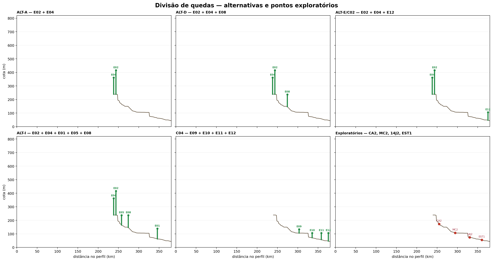
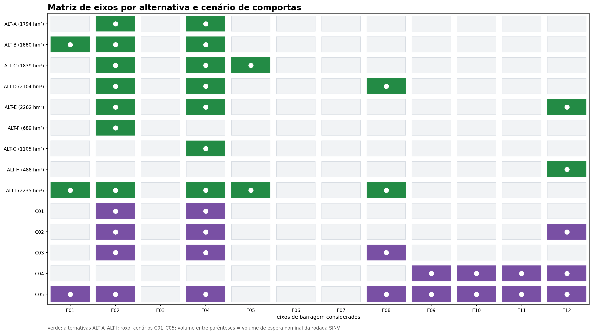
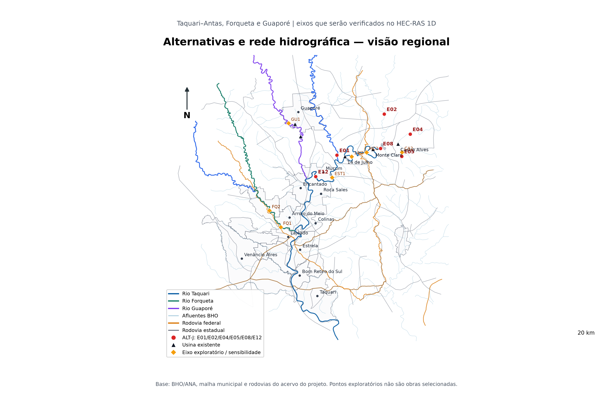
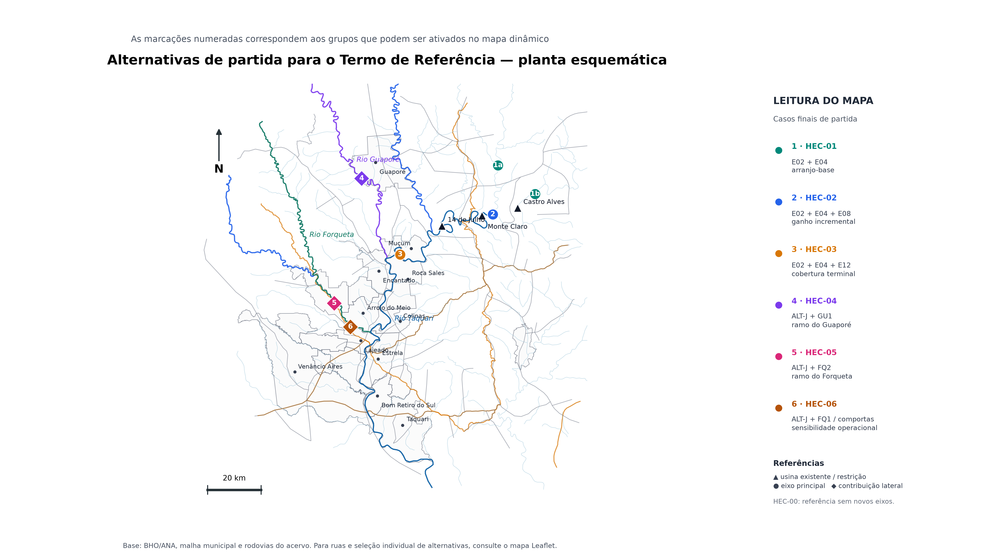
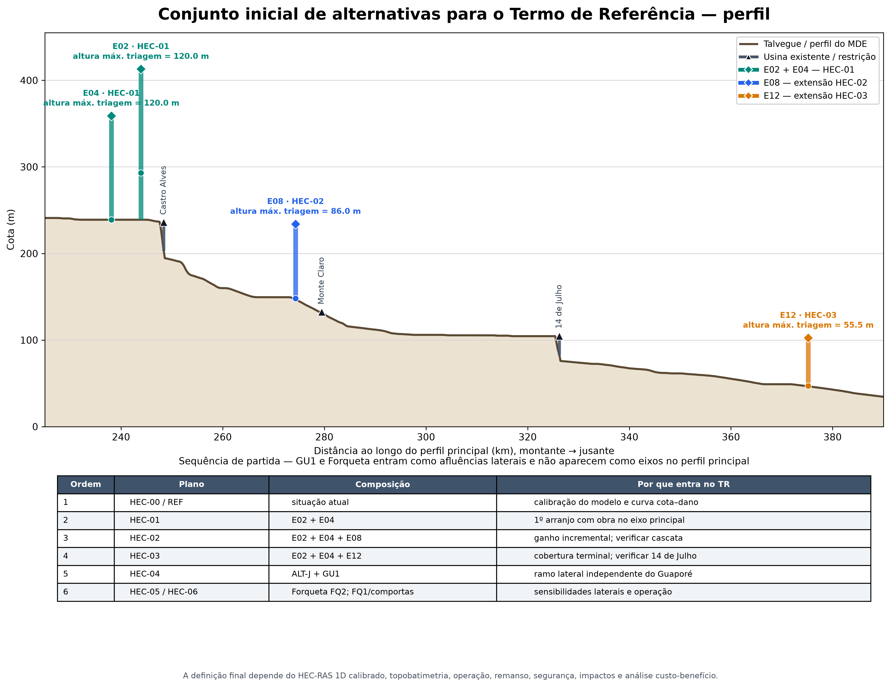
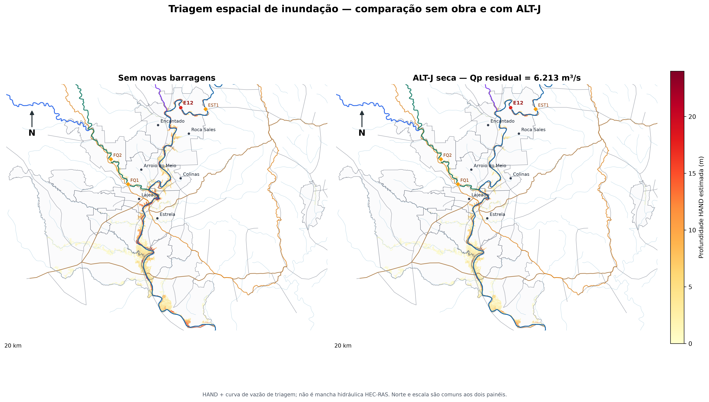
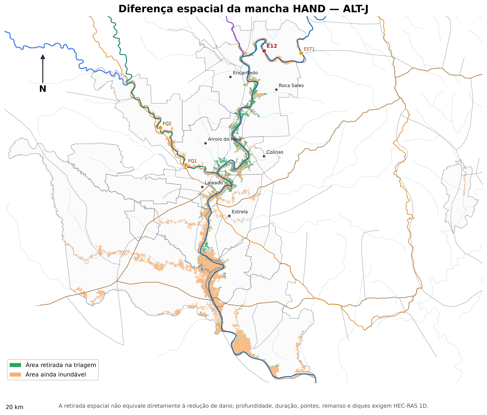
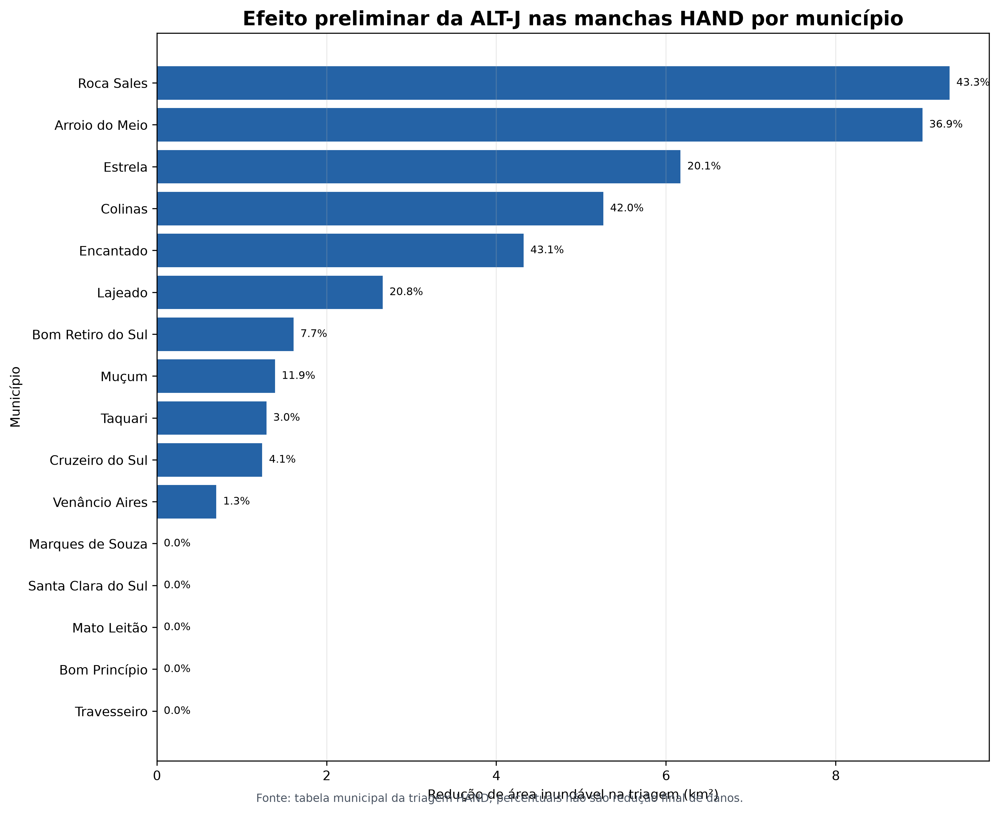
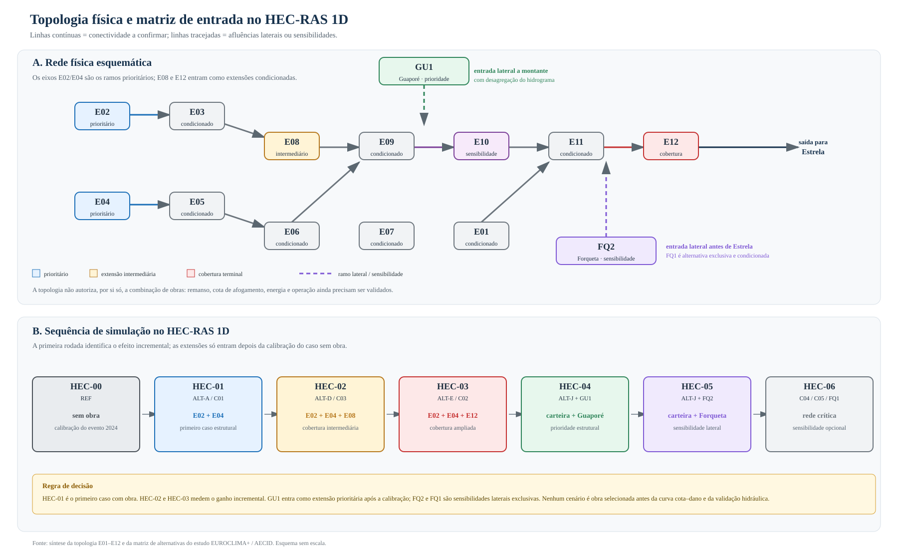
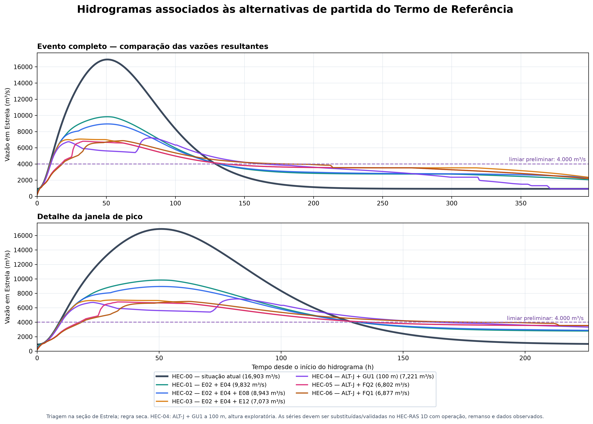

# Relatório consolidado, leitura imparcial e plano de continuidade

::: {.callout-important}
## Síntese executiva

Este capítulo reúne os resultados produzidos até 07/09/2026 e organiza a decisão que a
contratante deverá tomar. O estudo ainda é uma **triagem técnica preliminar**: não há
alternativa de barragem selecionada, não houve execução do HEC-RAS e as cifras de dano,
custo e energia ainda não são suficientes para uma decisão de investimento.
:::

## Pergunta decisória

O trabalho procura responder, em ordem de grandeza, se reservatórios de montante poderiam
reduzir as vazões, níveis, áreas inundáveis e danos no corredor do rio Taquari–Antas com
foco em Estrela/RS. A pergunta correta não é apenas “qual barragem armazena mais?”, mas:

1. qual parcela da cheia chega ao ponto de controle e em que momento;
2. quanto armazenamento é fisicamente utilizável antes do pico;
3. qual redução de nível, profundidade, duração e área resulta em cada município;
4. quais impactos, custos, perda de energia, remansos e riscos operacionais são criados;
5. se uma solução com barragens é melhor do que proteção local, diques, medidas não
   estruturais ou uma combinação dessas opções.

O objeto desta nota é subsidiar um Termo de Referência. Ela não substitui estudo de
viabilidade, projeto básico, avaliação de segurança de barragens, licenciamento ou
consulta às comunidades afetadas.

## O que foi analisado

### Dados territoriais, relevo e GIS

Foram organizados os eixos do `EUROCLIMA-rev.kmz`, a rede hidrográfica, áreas de
contribuição, municípios, usinas existentes, reservatórios e o trecho detalhado. O fluxo
de trabalho usa o MDE do projeto, indicado como derivado do ANADEM, com processamento D8,
perfil longitudinal e HAND. As geometrias de inspeção foram reunidas em GeoPackages,
Shapefiles e KMZs; o [catálogo territorial e de CAVs](06_resultados/tabelas/catalogo_cavs.csv)
é a referência para rastrear cada eixo.

O trecho detalhado preliminar preparado para o HEC-RAS tem 39,40 km de eixo, 102 seções,
quatro travessias e seis confluências. A auditoria espacial encontrou 19.440 km² no
limite de montante, 4.002,3 km² em seis laterais e 23.699 km² no limite de jusante; resta
explicar uma diferença de 256,7 km² antes de fechar os contornos hidráulicos. Esse
fechamento é uma condição de qualidade, não um ajuste cosmético: somar laterais sem
resolver a diferença pode contar a mesma água duas vezes.

### Curvas cota–área–volume e volume de espera

As CAVs das usinas existentes foram confrontadas com a base de metadados do SNIRH. Para
os novos eixos, a CAV foi aproximada a partir de curvas de nível e da área alagada
estimada no MDE, com interpolação e ajuste de curvas. Essa abordagem é aceitável para
triagem de alternativas ainda sem reservatório, mas deverá ser substituída ou validada
por levantamento topográfico, geologia, batimetria e projeto de engenharia.

É essencial distinguir duas grandezas:

- `V_req = ∫ max[0, Q_Estrela(t) − Q_alvo] dt`: volume ideal requerido na seção de
  controle para retirar o excesso acima da vazão-alvo;
- `V_espera,i = f_esp × V_max,i(H_i)`: capacidade nominal de espera do eixo `i`, obtida
  da CAV, da altura adotada e da fração de espera.

Na rodada atual, `V_req` **não foi distribuído por uma otimização entre reservatórios**.
Cada eixo recebeu sua própria altura admissível e fração de espera, e a cota de operação
foi obtida invertendo a sua CAV. Logo, não existe uma cota única para toda a alternativa.
O roteamento determina posteriormente quanto cada reservatório realmente armazena, quando
satura e qual vazão entrega a jusante.

O valor de `Q_alvo = 4.000 m³/s` é uma referência preliminar na seção de controle em
Estrela, não uma vazão a montante de Estrela nem uma vazão legal de “não inundação”. Ele
será substituído por uma relação cota–profundidade–dano calibrada no HEC-RAS e por dados
observados.

### Hidrologia e roteamento

Foram usados postos da ANA/HidroWeb e hidrogramas de triagem para testar a sincronização
das contribuições do Antas, Forqueta e Guaporé. A rodada calibrada C1–C4 estimou pico
natural de 16.299 m³/s na seção de 19.440 km² e pico residual de 6.213 m³/s para ALT-J
na regra de barragem seca. Esses números são úteis para comparar hipóteses, mas não são
resultados hidráulicos finais.

O histórico de eventos também mostrou que maio de 2024 e novembro de 2023 não devem ser
tratados como se fossem o mesmo evento: um pode ter maior volume, outro maior pico e
defasagens diferentes. A frequência estatística e a transposição precisam ser revisadas
com a série final, sem chamar automaticamente um evento de “100 anos”.

Foi ainda avaliado o gerador de séries sintéticas Kirsch–Nowak. Ele pode produzir um
ensemble diário multissítio para estudar coincidência de cheias, duração e confiabilidade
do armazenamento, mas assume uma estrutura estacionária e não substitui a calibração dos
eventos nem o HEC-RAS. A [auditoria das entradas](06_resultados/VALIDACAO/AUDITORIA_ENTRADA_KIRSCH_NOWAK.md)
encontrou uma janela comum bruta de aproximadamente 66,9 anos de calendário para os
postos candidatos, ainda com lacunas e necessidade de harmonização; Estrela deve ser
reservada principalmente para validação do exutório.

### Alternativas estruturais e operacionais

Foram analisados alteamento das UHEs existentes, eixos novos E01–E12, cascatas com
comportas, novos pontos exploratórios no perfil, Forqueta e Guaporé.

O alteamento permanece como sensibilidade. Para as três UHEs existentes, a ordem de
grandeza disponível indica cerca de 105 hm³ para 10 m e 139 hm³ para 15 m, diante de
3.230 hm³ usados como referência de volume requerido. Em um recorte mais amplo de usinas,
o ganho estimado para 10 m foi 220 hm³, ou 6,8% da mesma ordem de grandeza. A leitura
imparcial é que o alteamento não está provado como impossível, mas os indícios apontam
para obra expressiva e ganho pequeno; por isso não deve comandar a primeira rodada.

A divisão de quedas revelou a restrição dominante: Monte Claro, Castro Alves e 14 de Julho
formam uma cascata existente que pode ser afogada por níveis de novos reservatórios. Por
isso, os eixos novos precisam ser avaliados pela interação longitudinal, e não somente
pela área de drenagem.

{#fig-relatorio-divisao-quedas width=100%}

{#fig-relatorio-matriz-eixos width=100%}

{#fig-relatorio-planta-hec width=100%}

### Conjunto de partida recomendado para o TR

Para orientar a contratação sem antecipar uma decisão de implantação, a primeira rodada deve
começar com a matriz **HEC-00–HEC-06**. E02 e E04 formam o arranjo-base; E08 e E12 medem
ganhos incrementais; GU1 é a hipótese estrutural independente do Guaporé; e FQ2 é a alternativa
lateral do Forqueta. FQ1, comportas e os pontos exploratórios do perfil entram como sensibilidades
condicionadas à calibração e à verificação das restrições existentes.

{#fig-relatorio-ponto-partida-planta width=100%}

{#fig-relatorio-ponto-partida-perfil width=100%}

As hastes no perfil são envelopes de altura admissível de triagem, não cotas de projeto. A
posição no perfil torna explícita a restrição da cascata Monte Claro–Castro Alves–14 de Julho;
no mapa, GU1 e FQ2 aparecem em seus tributários e serão representados no HEC-RAS 1D como
estruturas ou afluências laterais, conforme a geometria disponível.

Para conferência detalhada, a [planta interativa com ruas, rodovias, rios, municípios,
eixos e usinas](06_resultados/GIS/mapa_interativo_alternativas.html) permite ativar e
desativar as camadas. O painel **Alternativas finais / TR** permite marcar uma ou mais alternativas
e visualizar, simultaneamente, todos os eixos de cada composição. A malha municipal e os pontos rotulados na imagem são referências
territoriais; o ponto representativo do município não deve ser interpretado como o
levantamento cadastral da sede urbana. A identificação de ruas depende da base
OpenStreetMap carregada no mapa interativo.

O Forqueta conflui a montante de Estrela e, portanto, não deve ser descartado. Ele deve
entrar como contribuição lateral nos controles de Lajeado, Estrela e Bom Retiro do Sul.
FQ1 e FQ2 são mutuamente exclusivos por interferência de cota; a lacuna de novembro de
2023 no posto 86745000 impede fechar a defasagem do maior evento de Estrela. O melhor
resultado da matriz preliminar foi ALT-J + FQ2, com cerca de 6.802 m³/s em Estrela, ainda
2.802 m³/s acima da referência de 4.000 m³/s.

O Guaporé passou a ser a hipótese estrutural independente mais promissora. O GU1 controla
preliminarmente 1.993,7 km² de uma sub-bacia de 2.486,7 km². Com ALT-J, o máximo histórico
do Santa Lúcia e GU1 a 100 m produziram 7.221 m³/s na triagem, com a contribuição natural
do Forqueta mantida na seção de Estrela. O resultado permanece acima da faixa-alvo e é
condicionado à desagregação correta do hidrograma para não contar novamente a contribuição
do Guaporé.

### Danos, exposição e economia

O Atlas Digital de Desastres do MDR foi extraído para os municípios do corredor. No
recorte hidrológico de 2024, os campos monetários preenchidos somam aproximadamente
R$ 234,4 milhões; no recorte estrito de maio de 2024, cerca de R$ 29,0 milhões. Esses
valores são pisos dos campos declarados, não o dano total nem o benefício automaticamente
evitável de uma barragem.

A curva cota–dano será construída combinando malha e agregados do IBGE, exposição física,
cadastros municipais quando disponíveis, custos de reposição/SINAPI, indicadores do Ipea
e danos observados no Atlas. A forma preliminar é:

`D(z) = Σ [exposição × custo de reposição × função de dano(profundidade)] + prejuízos públicos + prejuízos privados`

O benefício de uma alternativa será `D_sem_medida(z) − D_com_medida(z)`, calculado para
cada evento e cenário hidráulico. Não será obtido por uma proporção simples entre volume
armazenado e um dano agregado. O placeholder de R$ 2,5 bilhões não deve governar o ICB:
sem dano real, toda conclusão econômica fica aberta.

## Efeito preliminar das barragens nas manchas HAND

### O que foi comparado

Foi produzida uma comparação espacial entre:

- **sem novas barragens**: evento natural de triagem, com `Qp = 16.299 m³/s`;
- **ALT-J seca**: carteira principal de triagem com E02 + E04 + E01 + E05 + E08 + E12,
  com pico residual de `6.213 m³/s`.

O processamento foi feito no corredor de 19 municípios, usando o MDE do projeto, a rede
de drenagem e a relação HAND + curva de vazão adotada na triagem. A comparação não inclui
GU1, FQ1, FQ2, diques ou proteção local; essas hipóteses serão inseridas separadamente
no HEC-04, HEC-05 e nos cenários híbridos.

### Resultado agregado

| Indicador | Sem novas barragens | ALT-J seca | Variação preliminar |
|---|---:|---:|---:|
| Área inundável HAND | 288,4 km² | 245,4 km² | −43,0 km² (−14,9%) |
| Pico na seção de controle | 16.299 m³/s | 6.213 m³/s | −61,9% |
| Média de profundidade nas células inundadas | 5,91 m | 4,41 m | −1,50 m |

O resultado é expressivo como ordem de grandeza, mas a interpretação correta é limitada:
reduzir 14,9% da área HAND não significa reduzir 14,9% do dano. Parte da área pode
continuar inundada com menor profundidade e duração, o que pode reduzir danos; outra parte
pode estar desconectada por remanso, pontes ou diques, o que só o HEC-RAS pode resolver.

{#fig-relatorio-hand-comparacao width=100%}

{#fig-relatorio-hand-diferenca width=100%}

### Distribuição municipal

Os maiores ganhos relativos da triagem ocorreram em Roca Sales, Encantado, Colinas,
Arroio do Meio, Lajeado e Estrela. A tabela mostra os municípios com redução positiva;
os demais municípios do corredor não apresentaram mudança de área no limiar simplificado.

| Município | Sem obra (km²) | ALT-J (km²) | Redução (km²) | Redução (%) |
|---|---:|---:|---:|---:|
| Roca Sales | 21,56 | 12,22 | 9,34 | 43,3 |
| Arroio do Meio | 24,46 | 15,44 | 9,02 | 36,9 |
| Estrela | 30,77 | 24,60 | 6,17 | 20,1 |
| Colinas | 12,53 | 7,27 | 5,26 | 42,0 |
| Encantado | 10,02 | 5,71 | 4,32 | 43,1 |
| Lajeado | 12,82 | 10,16 | 2,66 | 20,8 |
| Bom Retiro do Sul | 20,91 | 19,31 | 1,61 | 7,7 |
| Muçum | 11,67 | 10,28 | 1,39 | 11,9 |
| Taquari | 42,78 | 41,49 | 1,29 | 3,0 |
| Cruzeiro do Sul | 29,96 | 28,72 | 1,24 | 4,1 |
| Venâncio Aires | 54,59 | 53,89 | 0,70 | 1,3 |

{#fig-relatorio-hand-municipios width=100%}

Estrela teve redução preliminar de 6,17 km², ou 20,1%, mas ainda permaneceu com 24,60
km² no limiar da triagem. Isso responde à pergunta de “quanto as barragens banham ou
retiram da mancha” somente no primeiro nível: indica área potencialmente retirada e
profundidade menor, mas ainda não informa cota de inundação, velocidade, duração,
edificações atingidas ou dano monetário. A próxima etapa obrigatória é repetir a leitura
com manchas hidráulicas de HEC-RAS 1D.

## Alternativas que devem ser simuladas no HEC-RAS 1D

As simulações precisam seguir uma sequência que preserve a comparação. O caso sem obra
vem primeiro, porque calibra o modelo e produz a referência de cota e mancha. O primeiro
caso com obra é E02 + E04; HEC-02 e HEC-03 medem ganhos incrementais. GU1, Forqueta e
comportas entram depois, com as contribuições laterais e regras próprias.

A planta regional e o diagrama abaixo tornam explícita a distinção entre o rio principal,
os tributários e a cascata existente. A ALT-J é uma carteira de referência da triagem,
não uma obra escolhida. O HEC-01–03 foi priorizado porque permite medir o ganho incremental
dos eixos E02/E04, depois E08 e E12, sob as restrições de Castro Alves e 14 de Julho.
O HEC-04 testa a contribuição independente do Guaporé; o HEC-05 testa o Forqueta como
afluência lateral; e o HEC-06 mantém comportas, FQ1 e combinações de rede como sensibilidades.

| Plano | Composição/entrada | Papel |
|---|---|---|
| HEC-00 / REF | situação atual, sem novos reservatórios | calibração de vazão, nível, tempo, mancha e jusante |
| HEC-01 / ALT-A | E02 + E04 | primeiro caso com obra; referência distribuída |
| HEC-02 / ALT-D | E02 + E04 + E08 | ganho incremental de E08, condicionado a Castro Alves |
| HEC-03 / ALT-E | E02 + E04 + E12 | cobertura terminal, condicionada a 14 de Julho |
| HEC-04 | ALT-J + GU1 | hipótese estrutural independente a montante |
| HEC-05 | ALT-J + FQ2 | contribuição lateral do Forqueta antes de Estrela |
| HEC-06 | C04, C05, FQ1 e rede crítica | comportas, saturação, galgamento e sensibilidades |

{#fig-relatorio-topologia width=100%}

No HEC-00, o hidrograma de montante deve coincidir com a seção associada aos 19.440 km²,
após o fechamento do balanço de áreas. No HEC-01–03, os efluentes de cada reservatório
devem entrar no ponto nodal correspondente; não se deve usar o pico agregado de Estrela
como entrada de montante e lateral ao mesmo tempo. No HEC-04 o Guaporé precisa ser
retirado da parcela residual do Antas antes do roteamento. No HEC-05 o Forqueta deve entrar
como afluência lateral, porque conflui antes de Estrela.

Cada plano deverá entregar: hidrogramas de entrada e laterais; cotas máximas e mínimas;
tempo de chegada; duração acima de patamares; profundidade; velocidade; área inundada;
volume retido; níveis e volumes de cada reservatório; e indicadores de dano por município.

### Hidrogramas associados aos casos HEC

A figura abaixo apresenta, na mesma seção de comparação em Estrela, o evento de referência
e o hidrograma preliminar associado a cada caso HEC. A regra adotada é a de barragem seca;
HEC-04 usa GU1 a 100 m como envelope exploratório. A figura serve para documentar a
associação entre alternativa e entrada hidráulica; os resultados oficiais dependerão da
calibração, do remanso e da operação no HEC-RAS 1D.

{#fig-relatorio-hidrogramas-hec width=100%}

## Barragens, diques e alternativas não estruturais

A comparação não deve ser encerrada quando a primeira barragem reduzir o pico. A
contratação deve avaliar pelo menos quatro famílias de solução:

1. barragens novas e operação coordenada;
2. barragens combinadas com diques ou proteção localizada de núcleos urbanos;
3. proteção não estrutural: alerta, previsão, rotas de fuga, ordenamento territorial,
   seguros, adaptação de edificações e continuidade de serviços;
4. alternativa de não implantação, caso remanso, energia, impactos, segurança, custo ou
   manutenção superem os benefícios.

O HEC-RAS deverá representar diques, aterros, estradas e estruturas somente quando suas
geometrias forem levantadas. Não é tecnicamente válido “desenhar” um dique a partir do
limite municipal ou da própria mancha HAND. Cada arranjo híbrido deverá ser comparado na
mesma cota de dano, no mesmo conjunto de eventos e com o mesmo horizonte econômico.

Ao final, há quatro decisões legítimas: (a) barragem viável e suficiente; (b) barragem
viável apenas combinada com proteção local; (c) solução híbrida ou não estrutural superior;
ou (d) barragens rejeitadas por inviabilidade técnica, econômica, ambiental ou de segurança.
O estudo não deve forçar uma alternativa estrutural se os resultados apontarem para (c)
ou (d).

## Análise técnica imparcial neste momento

### O que já é consistente como direção

- a cascata Monte Claro–Castro Alves–14 de Julho é a principal restrição de desenho;
- aumentar simplesmente a quantidade de eixos da carteira atual não levou Estrela à faixa
  preliminar de 4.000 m³/s;
- ALT-J é a melhor carteira de triagem do eixo principal entre as testadas, mas ainda
  deixa pico elevado e mancha residual;
- o Guaporé merece aprofundamento porque acrescenta controle a montante sem ser uma
  simples duplicação dos eixos E01–E12;
- o Forqueta é relevante por confluir antes de Estrela e deve ser simulado como lateral,
  embora FQ1/FQ2 sejam mutuamente exclusivos e dependam de dados melhores;
- o HAND já permite comunicar a ordem de grandeza da redução espacial, mas não substitui
  cota, remanso, pontes, duração e velocidade do HEC-RAS 1D.

### O que ainda não pode ser afirmado

- que 4.000 m³/s seja o limiar de não inundação;
- que a altura de qualquer eixo seja admissível ou segura;
- que a redução de área HAND seja a redução de dano;
- que o ICB seja positivo, pois dano, CAPEX, OPEX, energia e impactos ainda não estão
  fechados;
- que ALT-J, GU1 ou qualquer outra carteira seja a alternativa escolhida;
- que uma mancha detalhada possa ser publicada como resultado hidráulico antes do HEC-RAS.

## Plano de continuidade e entregas

### Fase 0 — fechar a base

Corrigir o balanço de 256,7 km²; registrar datum horizontal e vertical; conferir as CAVs;
separar superfície d’água de fundo; identificar séries aninhadas; e manter um manifesto
de versão, qualidade e origem de cada arquivo.

### Fase 1 — fechar a hidrologia

Recalibrar os eventos com ANA/ONS; produzir hidrogramas incrementais no nó de cada eixo;
desagregar o Guaporé; confirmar o Forqueta com dados subdiários de Barra do Fão; testar
Kirsch–Nowak como ensemble diagnóstico; e documentar defasagens, volumes e incertezas.

### Fase 2 — construir o modelo hidráulico

Obter topobatimetria no trecho detalhado; levantar pontes, pilares, aterros, diques,
seções de controle e jusante; substituir seções sintéticas; calibrar rugosidades e
condição de contorno; e montar o projeto nativo do HEC-RAS 1D.

### Fase 3 — simular e mapear

Executar HEC-00, HEC-01, HEC-02 e HEC-03 nessa ordem. Depois executar HEC-04 (GU1), HEC-05
(FQ2) e HEC-06 (FQ1, comportas e rede crítica). Para cada caso, produzir manchas, níveis,
profundidades, velocidades, duração e incerteza. Só então substituir a comparação HAND
pela comparação hidráulica.

### Fase 4 — dano e custo–benefício

Cruzar profundidade e duração com setores do IBGE, edificações e cadastro municipal;
aplicar custo de reposição por classe; calibrar com o Atlas; calcular dano evitado,
energia não gerada, CAPEX, OPEX, desapropriação, impactos, risco residual e valor presente
líquido. Publicar sempre cenário baixo/base/alto.

### Fase 5 — Termo de Referência

O TR deverá exigir dados brutos e editáveis, geometrias, séries, CAVs, regras de operação,
calibração, arquivos nativos do HEC-RAS 1D, mapas por município, curva cota–dano,
memória de cálculo, análise de segurança, energia, meio ambiente, alternativas híbridas e
uma conclusão que possa recomendar a implantação, a complementação por diques ou a não
implantação.

## Divisão de trabalho para acelerar

| Frente | Codex | Claude Code |
|---|---|---|
| Base e rastreabilidade | consolidar relatório, site, índices, mapas HAND e manifestos | revisar consistência dos resultados e documentar origem dos arquivos |
| Hidrologia | auditoria das séries, volume requerido, comparação com/sem obra e ensemble | desagregação Guaporé/Forqueta, regras de operação e séries nodais |
| HEC-RAS 1D | manter matriz de cenários, contornos e indicadores de saída | especificar geometria, topobatimetria, pontes, jusante e montagem nativa |
| Alternativas | integrar ALT-J, GU1, FQ1/FQ2, MC2/CA2/14J2 e híbridos no relatório | revisar restrições de remanso, energia, altura e comportas |
| Danos e TR | organizar curva cota–dano, mapa de entregas e texto do TR | revisar requisitos técnicos e critérios de aceitação |

## Conclusão de trabalho

O próximo passo não é escolher uma barragem com base no maior volume. É calibrar o caso
sem obra, simular a sequência HEC-00–HEC-06 e comparar a redução de nível e dano com
alternativas híbridas. A carteira ALT-J é uma referência de triagem; GU1 é a extensão
estrutural prioritária; Forqueta permanece uma alternativa lateral relevante; o alteamento
fica em segundo plano; e a hipótese de diques ou de não implantação deve permanecer aberta.

Até que o HEC-RAS 1D e a curva cota–dano sejam fechados, a conclusão técnica responsável
é: **há sinal de redução de pico e de mancha com reservatórios, mas ainda não há evidência
suficiente para declarar viabilidade, suficiência ou prioridade de qualquer obra**.

## Arquivos de apoio

- [Auditoria dos contornos do HEC-RAS](06_resultados/VALIDACAO/AUDITORIA_CONTORNOS_HECRAS.md)
- [Avaliação do gerador Kirsch–Nowak](06_resultados/AVALIACAO_KIRSCH_NOWAK_EUROCLIMA.md)
- [Estratégia da curva cota–dano](06_resultados/CURVA_COTA_DANO_ESTRATEGIA.md)
- [Matriz de cenários HEC-RAS 1D](06-hecras-1d.qmd)
- [Alternativas e justificativas](03-alternativas.qmd)
- [Resultados municipais da mancha HAND ALT-J](06_resultados/tabelas/manchas_por_municipio_ALTJ_seca.csv)
- [Diagrama topológico](06_resultados/VALIDACAO/DIAGRAMA_TOPOLOGICO_ALTERNATIVAS_HECRAS.svg)

As bases metodológicas incluem o [Atlas Digital de Desastres](https://atlasdigital.mdr.gov.br/paginas/graficos.xhtml#),
as [malhas de setores censitários do IBGE](https://www.ibge.gov.br/geociencias/organizacao-do-territorio/malhas-territoriais/26565-malhas-de-setores-censitarios-divisoes-intramunicipais.html),
os [metadados de CAV do SNIRH](https://metadados.snirh.gov.br/geonetwork/srv/api/records/b8f0487a-df73-4f8d-8b22-bb49cf9f3683),
o trabalho técnico sobre [HAND](https://files.abrhidro.org.br/Eventos/Trabalhos/60/PAP022598.pdf),
o artigo de reconstrução de relações de reservatórios [Domeneghetti et al.](https://doi.org/10.1002/2015wr017967)
e o [repositório do gerador Kirsch–Nowak](https://github.com/julianneq/Kirsch-Nowak_Streamflow_Generator).
